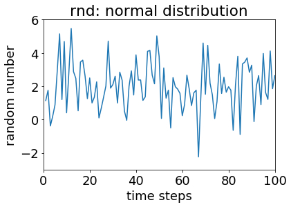

P1-E005 - R/W and Visualisation
================================

In this exercise, you will learn about reading from files, writing into files, operations with the *numpy* library and visualising data with the *matplotlib* library.

Information
----------- 

+----------------------+--------------------------------------------------------+
| Topic                                                                         |
+======================+========================================================+
|**Concepts**          |                                                        |
|                      |   * reading/writing (r/w) data                         |
|                      |   * data visualisation                                 |
+----------------------+--------------------------------------------------------+
|**Skills**            |                                                        |    
|                      |   * simple operations with *numpy*                     |
|                      |   * read and write input/output                        |
|                      |   * create simple plots with *matplotlib*              |
+----------------------+--------------------------------------------------------+

.. topic:: What to Submit

      Submit your script(s), output file(s) and figure(s) for the final task of this exercise. These script should be named *[your surname]_e005.[ext]*, where *[ext]* is the file extension, the input/output file should be named *[your surname]_[input/output]_e005.asc*, and the figure should be named *[your surname]_e005.jpg*.

      
NumPy and Matplotlib
--------------------

NumPy is a very commonly used Python library for numerical computing. Many other Python libraries use NumPy. Matplotlib, on the other hand, is one of the most commonly used Python libraries for plotting scientific data and results. In this excercise, we make heavy use of those two libraries, because (a) they are very commonly used, (b) they have fewer dependencies than many alternatives, and (c) there are comparable libraries for other programming languages you may prefer using. In fact, Matplotlib's *pyplot* is similar to plotting with Matlab.
      
Input/Output      
------------

In exercises E001 - E004, we have covered the basics of practical programming, procedural and object-oriented programming and let the computer perform various tasks for us. However, so far, we created data within our scripts, and the results of our calculations were lost once we ended our coding session. In this exercise, we will learn how to read data from a simple text file and write your results into another. Reading and writing into files of a specific formats, such as netCDF, requires the use of specific libraries. In some cases, different libraries allow you to perform the same input/output actions; in other cases, you may not even need to load any libraries to read and write into simple files. To reduce the number of libraries we use in this excercise, **we will only deal with simple text(ascii) files read and write data with NumPy**.

RNG Testing
-----------

.. figure:: dice_cc0.jpg

Imagine we have written a Fortran module *rnd*, a random number generator (RNG) that creates random numbers from a specific distribution. We want to test this module now and created two time series: One for random normally distributed data, and one for random data from an exponential distribution. We now want to quickly plot the test series to check if they look reasonable. Our Fortran programme generated two text files for the series: 

* :download:`test_rnd_normal.asc <test_rnd_normal.asc>`  
* :download:`test_rnd_exponential.asc <test_rnd_exponential.asc>`  
    
Let's download the files above and use NumPy to read those files and store the data in *dat_nrm* and *dat_exp* respectively. The reading is done by using NumPy's *genfromtxt()* function, a general function for reading data separated by common separators, such as spaces and commas.

.. code-block:: python
    
    # import module
    import numpy as np
    
    # read files
    dat_nrm = np.genfromtxt('test_rnd_normal.asc')       
    dat_exp = np.genfromtxt('test_rnd_exponential.asc')   
    
    # display data
    print(dat_nrm)
    print(dat_exp)
    
.. note:: There are different way in which text files can be read even with NumPy. *loadtxt()* is another option. 

Notice how we have two values per line: The first we interpret as a time step, the second is the data of interest. Unless we have magical statistics-vision (Stat-Woman to the rescue!), we won't be able to tell from this data dump how the data is distributed. We use matplotlib to visualise our data. Let's start with the random numbers from a normal distribution. Examine and execute the code below:

.. code-block:: python

    # import module
    import numpy as np
    import matplotlib.pyplot as plt

    # read files
    dat_nrm = np.genfromtxt('test_rnd_normal.asc')
    dat_exp = np.genfromtxt('test_rnd_exponential.asc')

    # pass data from normal distribution to x and y vectors
    x=dat_nrm[:,0]
    y=dat_nrm[:,1]

    # create simple x-y plot
    plt.figure(0)                          # number your figures
    plt.plot(x, y)                         # create a simple x-y plot
    plt.title('rnd: normal distribution')  # set a title
    plt.xlabel('time steps')               # label the x axis
    plt.ylabel('random number')            # label the y axis  
    plt.axis([0, 100, -3, 6])              # give x and y bounds

We should now be looking at a figure like this:

    
Once you think you know what's going on here, expand the script to include code that plots the data from the exponential distribution. Feel free to browse the web for plot options and choose the type of plot you regard as most fitting for exponentially distributed data. Think about the type of data visualisation that will most easily allow you to get a sense of the frequency distribution of random numbers. 

**Ask the instructor(s) for help if needed.**

Creating a histogram from your vectors may be one option to better visualise the randomly generated numbers. If you haven't already, generate a histogram from one of your y vectors and save it into a text file as such:

.. code-block:: python
    
    # create a histogram from y, use 10 bins
    y_hist=np.histogram(y,bins=10)  
    # write frequency in file
    np.savetxt('histogram.asc', y_hist[1], fmt='%1.3f')  

Note that we only write the frequency of y_hist using *savetxt()*, and we specify a format (fmt). Is this the best way to go about it? If not, what would you do differently? 

Your Task
---------

We're finally sufficiently equipped to do something useful. For the final task in phase 1 of this course, create one or several scripts that make use of the following:

* arrays
* functions
* classes
* reading/writing data
* data visualisation

You are given complete creative freedom here. The only requirement is that the type of tasks you instruct the computer to do are warranted. In case you need some inspiration, here is one way you can build on your work of previous exercises:

* create a class for students, and create several objects for this class
* for different semesters, read the grades of students from a text file
* using a class-specific function, calculate the average and semester average grades for each object (student)
* write the average grades into a text file 
* plot the grades in a way that allows you to get a sense of the distribution of grades or the progress of individual students

When you are happy with your code, data and plots, name your files as described above and submit them via ILIAS.

.. warning::

    Late submissions won't be accepted!
