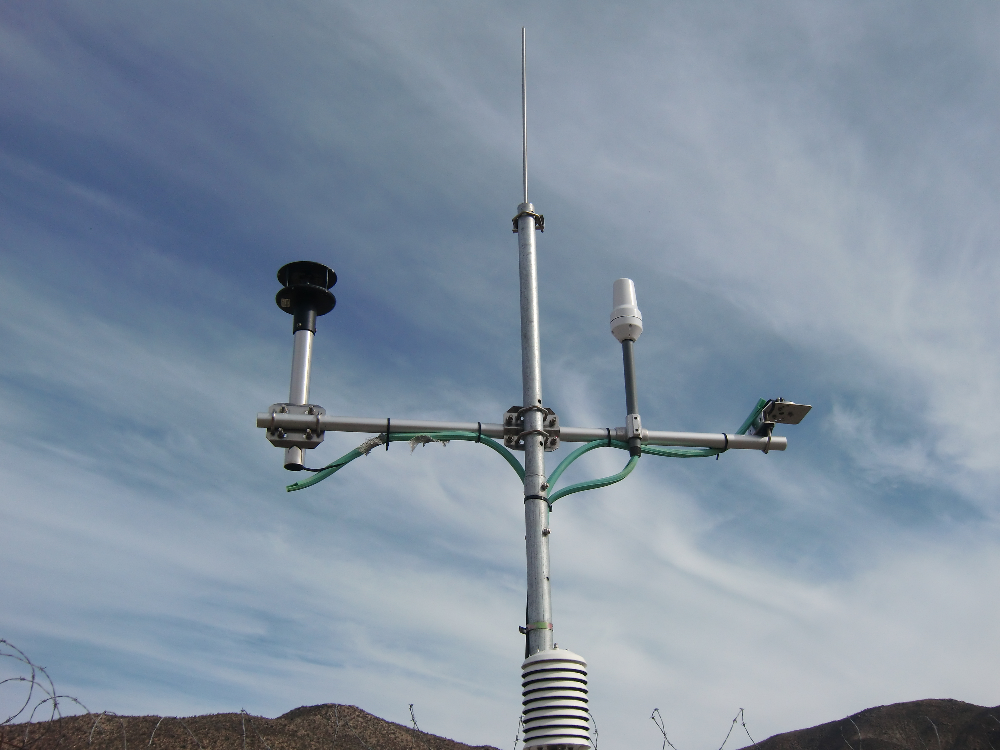

P2-E002
=======

In the accompanying lecture to this exercise, you learned about classic statistical hypothesis testing. This exercise is designed to give you some practice with this topic, as well as with data handling and processing.

Information
----------- 

+----------------------+--------------------------------------------------------+
| Learning goals                                                                |
+======================+========================================================+
|**Skills**            |                                                        |    
|                      |   * data processing                                    |
|                      |   * statistical hypothesis testing                     |
+----------------------+--------------------------------------------------------+

.. topic:: What to Submit

      Submit your script(s) and 1-2 sentence answers to the questions for the tasks of this exercise via ILIAS. You may include the answers as comments in your script(s). Make sure to also comment each of your calculations (using the terminology you were introduced to). The script should be named *[your surname]_e102.[ext]*, where *[ext]* is the file extension. In case of Python, this would be *.py*, for Matlab it is *.m*, etc.

.. note:: For this exercise, we'll take a frequentist approach to probability and uncertainty.      
      

      
Hypothesis Testing: Temperatures near Antofagasta      
-------------------------------------------------

You are provided with a time series of a weather station near Antofagasta (South America): 

:download:`Antofagasta.cvs <Antofagasta.csv>`   

Regional climate models were forced with boundary conditions reflecting a low-emission-scenario state of technological and demographic developments. They simulated a climate for the 2070-2100. The model produced local January temperatures that have a mean of 23.6°C, and June temperatures with a mean of 17.2°C. You want to know if we see an increase in January and June temperatures near Antofagasta under the low-emission scenario. Using the dataset you are provided with, calculate the predicted temperature changes and determine if the signals are real or still within reasonable range of the observed temperature variability. Formulate testable hypothesess and apply your knowledge of statistical hypothesis testing, "p-values" and significance levels to answer this question.

**HINT**

* You need models (PDF) to describe your null hypotheses. Think about how you would construct such a model for the problem you want to solve.

.. warning::

    Late submissions won't be accepted!

    
