P3-E201
=======

The objective of this exercise is to introduce you to a practical approach for collecting atmospheric data by using efficient and inexpensive devices with the goal of obtaining programming skills as well. However, basic command line skills are required but not entirely necessary to complete this exercise. This tutorial requires no previous knowledge of programming and experience with Raspberry Pi. It has been designed to allow everyone to successfully complete the exercise without difficulties in understanding an of the steps. We will be building a small weather station with BME280 sensor connected to a Raspberry Pi Zero W with a small OLED screen attached to display the reading from the sensor. Note that any version of Raspberry Pi can be used for this exercise and the purpose can also be equally achieved without the use of OLED screen. Raspberry Pi is a small single-board (like credit card) computer that are used for many practical projects especially for young people with the goal of learning programming and hardware skills (for more details, go to official site for Raspberry Pi). It will be used in this exercise as a minicomputer to control an electronic sensor and OLED display screen. Moreover, BME28O device developed by Bosch (Bosch site contains all the technical details) will be used as a digital barometric pressure sensor that measures temperature, pressure and humidity. After completing this exercise, you should be conversant in assembling and programming (using python) weather and environmental sensing system on Raspberry Pi. 

Information
----------- 

+----------------------+--------------------------------------------------------+
| Learning goals                                                                |
+======================+========================================================+
|**Concepts**          |                                                        |
|                      |   * atmospheric measurement systems                    |
|                      |   * automated recordings                               |
|                      |   * basic electronics                                  |
+----------------------+--------------------------------------------------------+
|**Skills**            |                                                        |    
|                      |   * work with a Raspberry Pi                           | 
|                      |   * create a simply atmospheric measurement system     |
|                      |   * collect your own data                              |
+----------------------+--------------------------------------------------------+

.. topic:: What to Submit

      Submit a short (~2 pages) summary of the steps you have taken to assemble and programme the Raspberry Pi. Also submit the script you wrote to create (and plot) records of your measurements.

Setting up the Raspberry Pi
---------------------------    

This section will introduce you to the hardware devices and software package required to complete this exercise. We will setup the Pi software on the computer with some initial settings that are required for the other devices. Follow the steps carefully and do not forget to read the referenced sites for more information.

Requirements
............

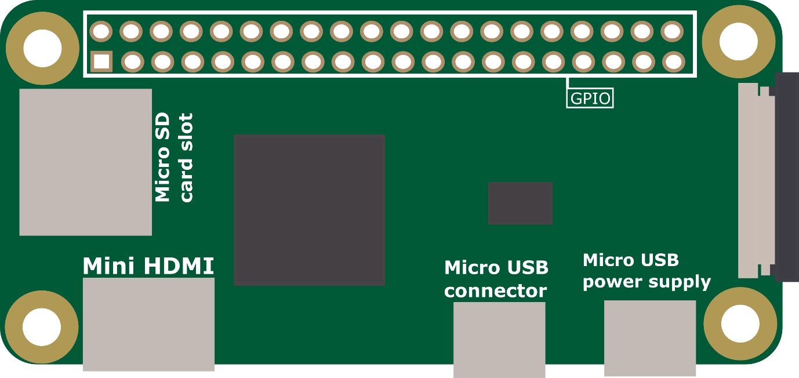
   
   Parts of Raspberry Pi Zero W

**Hardware**

- Raspberry Pi computer will all accessories (SD card, power cable, HDMI adaptor, USB micro connector)
- Monitor with HDMI port and cable
- USB hub (with at least 2 slots, optional)
- USB Keyboard and mouse

**Software**

- Raspberry Pi OS

Installing Raspberry OS
.......................

First, download OS product (with desktop is recommended for new users) from the Raspi OS site and unzip the downloaded folder. Use OS image flasher on your personal desktop to flash the downloaded image of the OS product onto an empty micro-SD card. If you do not have image flasher already installed on your computer, the “balenaEtcher” can easily be download from this site Etcher software (for windows/Linux/MacOS) and then install for flashing the OS image. After getting the Raspbian installed on SD card, insert it into the Raspberry Pi via the SD card slot.

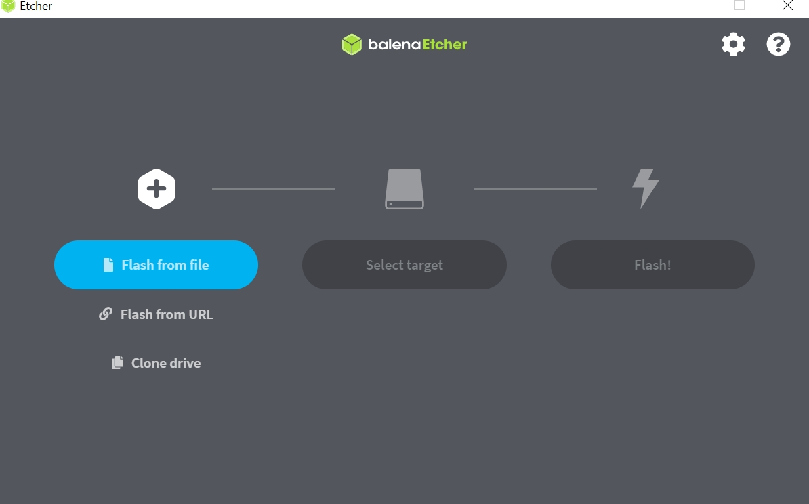
   
   View of after installing the balenaEtcher software on your personal computer.

Second, connect the Raspberry Pi to your monitor via the HDMI port, to power supply via the micro-USB power connector and to USB hub via the micro-USB connector. Then connect your keyboard and mouse to the USB hub. However, in case USB hub is not available, you can connect a keyboard directly to the micro-USB connector which means that everything will have to be controlled with the keyboard. If you have well experienced with command line syntax, then a mouse is mostly not required but recommended. After setting everything up, switch on the power supply to get the Raspbian running. You will see a red light blinking on the Raspberry Pi and the graphical display of the desktop screen will show on your monitor after booting the system up. The next step is to setup the software and connect internet via Wi-Fi. Normally the welcome screen of the Raspbian application is to guide you through how to set up the system. Follow the pop-up window to set the language, country and time zone. On the next step, it is always recommended to change the default password on the Pi for security reasons. Use next section of the welcome to Raspberry Pi window to change the default “pi” user account password which is “raspberry” to your new password (make sure you know it well). Use the next section to connect it to Wi-Fi by selecting your Wi-Fi name and enter the security password. In case you are in environment where further installations are required, its better to get help on how to set up the specific Wi-Fi on a Linux environment (e.g., “Eduroam” in many universities in Germany). If you are using a Pi version that has ethernet cable, then direct connection will give you access to internet without the Wi-Fi setup. Finally, use the last wizard to check for any updates and reboot the to finish the set up. 

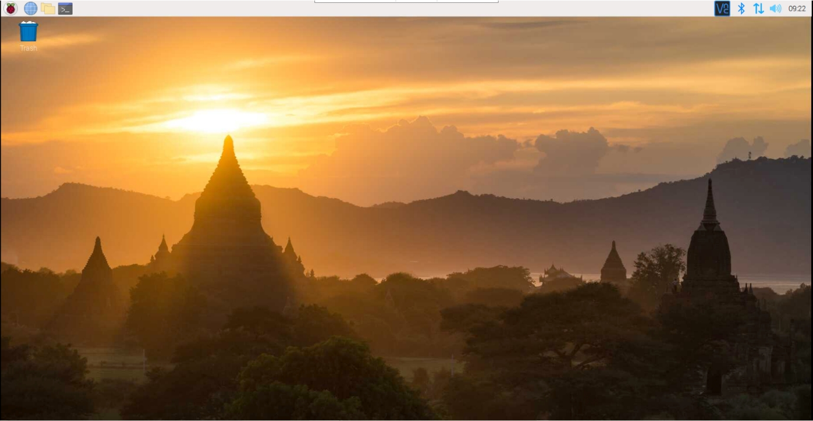
   
   Desktop view after booting the Raspbian software on the Pi.

Raspberry Pi Configuration Settings
....................................

This step will introduce you to further configuration setting required to connect the devices and also to enable you to access your Pi remotely. The electronic sensor and OLED screen use I2C interface to communicate with the Pi, therefore it must be enabled since it is disabled by default. More specifically, I2C is a multi-device bus utilized to connect low-speed peripherals to computer and embedded systems. On the Raspberry Pi, its interface can be connected using additional pins on the GPIO header. On the other hand, we will enable the Secure Shell (SSH) interface to connect the Pi remotely (using command line) since we do not want to connect the whole setup to a monitor before we can access the data recorded by the sensor. Alternatively, we will enable Virtual Network Computing (VNC) interface if we want to access the graphical user interface of the Pi on your personal computers.   

**Method 1**
Using **“raspi-config”** on command line/terminal
You can locate the terminal on the menu bar, and you can start running the following command:

>> **sudo raspi-config**

This will display the raspi-config utility window. Select the **“interfacing Options”**.

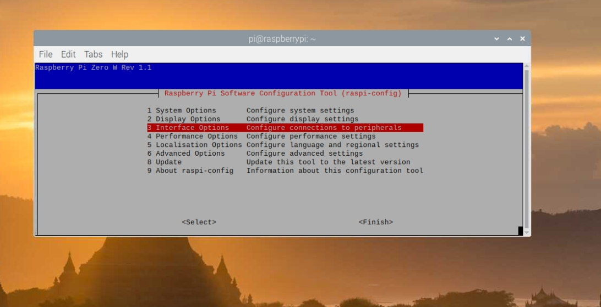

Then select I2C on P5 and select “Yes” to activate.  Repeat the same steps for VNC (P3) and SSH (P2) to activate them as well. In the end, when prompted to reboot now, click Yes to enable the activated interfaces. 

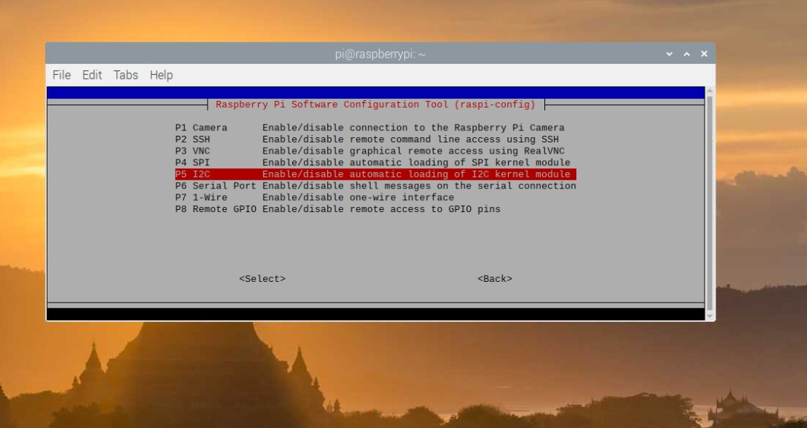

**Method 2**
Using the graphical interface to activate the interfaces. 
When the Raspberry Pi boots to the desktop view, you can click on Menu > Preferences > Raspberry Pi Configuration

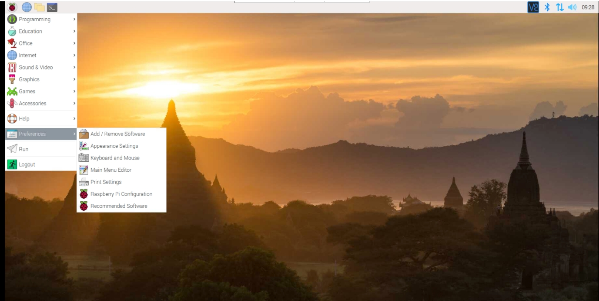

Then you can select interfaces tab and select I2C, VNC, and SSH to Enabled.

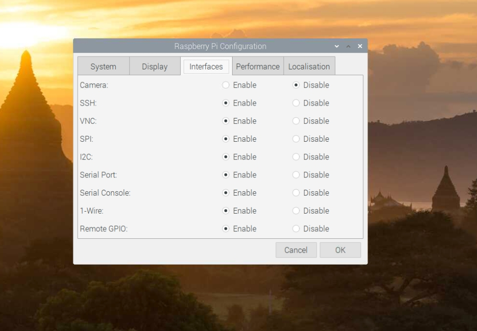

After that click on OK and if asked to reboot select Yes to activate the interface for the system
To learn how to access Raspberry Pi remotely via SSH or VNC, follow the detailed tutorial on raspberry pi website for SSH connection  and VNC connection, respectively. 

Installing python and some libraries
------------------------------------

The latest Raspbian software sometimes comes with python3 already installed. So, we will update it if installed or install it if it does not work for you. 

Run the following commands for standard updates on the terminal:

>> **sudo apt-get update**

>> **sudo apt-get upgrade**

>> **sudo pip3 install –upgrade setuptools**

If it does not work, then try to install with:

>> **sudo apt-get install python3-pip**

Installing libraries required for controlling the bme280 and ssd1306 OLED screen. 

We will be using pip3 to install all the required library (with sudo permission, which is sometimes not required).

Run the following commands on the terminal to install the libraries that will be used in the script for this exercise. 
Install i2c bus to monitor parameters from the GPIO board (check the SMBus site for more details) and BME280 python package to control the electronic sensor(check RPi.bme280 site for more details). Alternatively, Adafruit_CircuitPython_BME280 can also be used if you are experienced with their products.

>> **sudo pip3 install smbus2**

>> **sudo pip3 install RPi.bme280**

We will use adafruit-ssd1306 (Adafruit_CircuitPython_SSD1305 official site) and Python Imaging Library (PIL official site ) to draw the text unto the OLED screen with customized fonts. More details can be found the internet by just googling them. 

>> **sudo pip3 install adafruit-circuitpython-ssd1306**

>> **sudo apt-get install python-pil**

We will use openpyxl to store the data in a created excel file on the desktop to keep track of all the reading from the sensor at a specific time.

>> **sudo pip3 install openpyxl**

After installing all the python libraries, reboot the Pi to get them ready to be installed.

      
Connecting external devices
---------------------------

In this section, we will connect all the hardware together. As already mentioned, we will use BME280 sensor and OLED screen to connect to our Raspberry Pi. To be able to connect them together, we will need the following:

1. Electronic circuit test breadboard
    
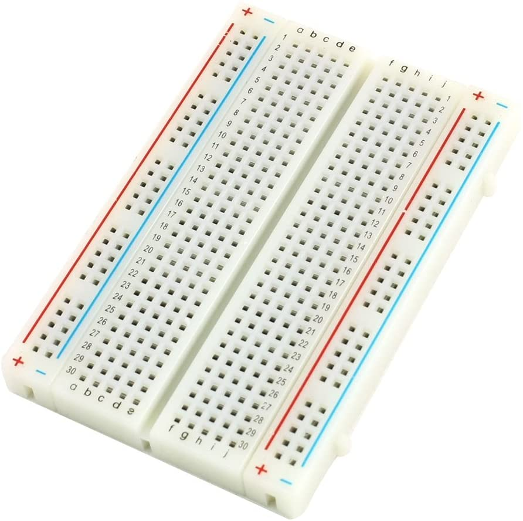
    

2. Jumper cables (both female to male, male to male connections wires)

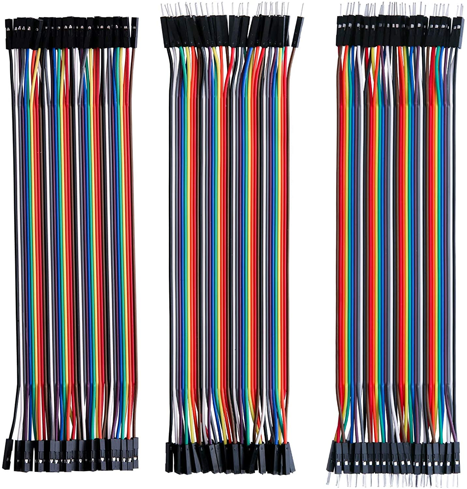

3. Soldering machine (if the sensor or screen are not already joined to their connecting pins)
First thing is to solder the pins to their connecting slots on the two devices. However, it is advisable to purchase them already solder together in order to skip this step. If you are interested in practising soldering, then it will be good to try this step too, but I can promise is challenging on the first attempt if you are not taught properly. 
The next step is to connect the Raspberry Pi’s GPIO header to the two I2C devices (when the Raspberry Pi is switch off). Multi-I2C devices connection is mostly not straight forward, so we will adopt a different approach as it would have been dealing with a single I2C wiring. Note that the two devices will get different address on the board, therefore, make sure the wiring is done correctly. I2C devices normally have four pins to be join to the GPIO header pins (i.e., VCC, GND, SCL, and SDA). So, we connect one of the devices using all the four pins and then connect I2C pins (SCL and SDA) to the other device using a close circuit on the breadboard as shown in the following steps:

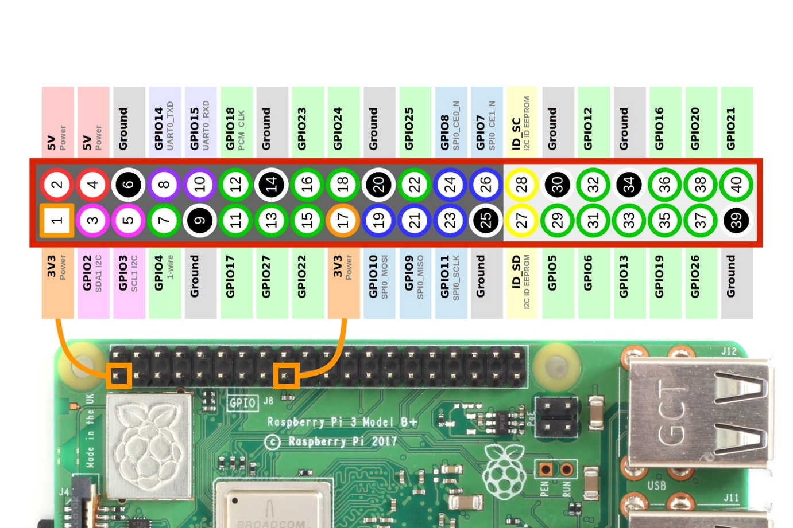

1. Place sensor and screen on the same line on the breadboard (example as on the f line as shown in the picture below).

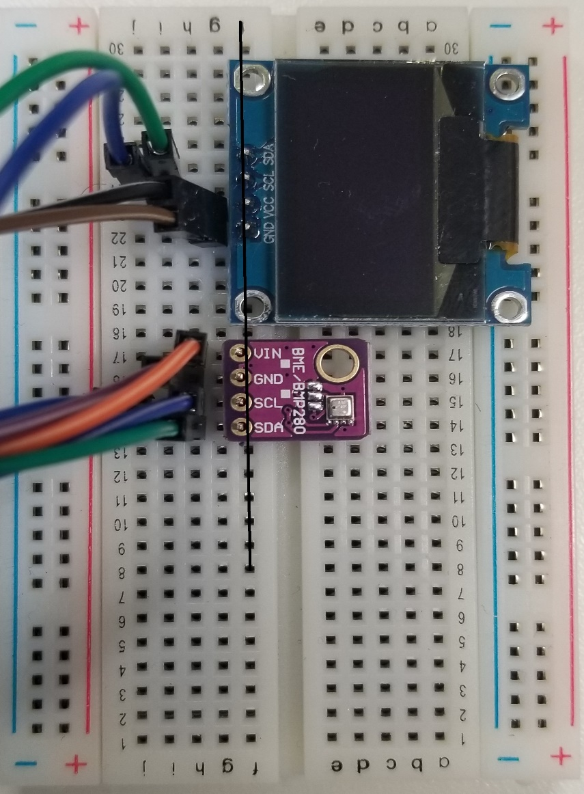

2. Use the female-male connection cables (4) to join one of the devices (e.g., bme280) to GPIO header by using the table below (use the GPIO header guide to locate the exact pins).

  +------------------------+--------------------------+-----------------------------+
  | Module                 | Description              | GPIO Header Pins            |
  +========================+==========================+=============================+
  | VCC                    | 3.3V                     | P-01                        |
  +------------------------+--------------------------+-----------------------------+  
  | GND                    | Ground                   | P-06                        |
  +------------------------+--------------------------+-----------------------------+  
  | SCL                    | 12C SCL                  | P-05                        |
  +------------------------+--------------------------+-----------------------------+  
  | SDA                    | 12C SDA                  | P-03                        |
  +------------------------+--------------------------+-----------------------------+  

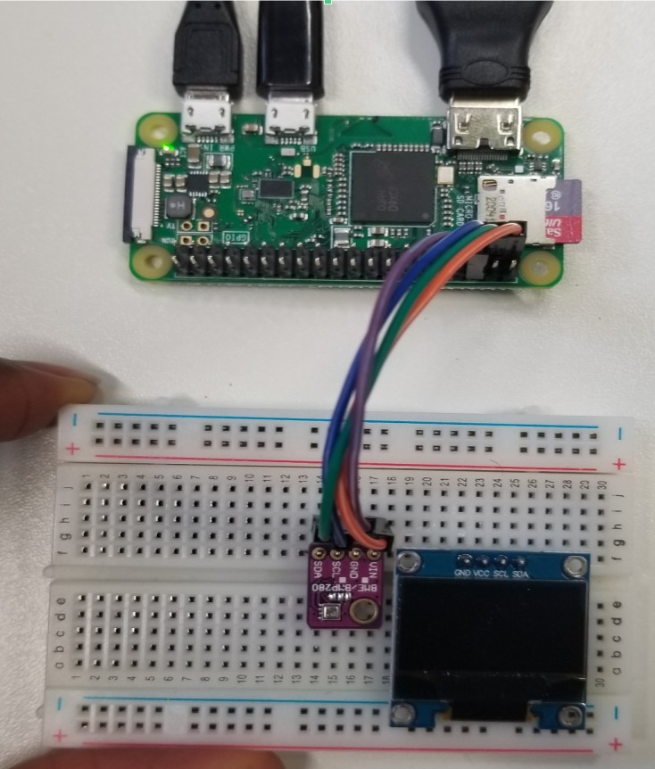
  
3. Use female-male connection cables (2) to connect the power (VCC) and ground (GND) of the other device (e.g., OLED screen) to the GPIO header pins using the table below.

  +------------------------+--------------------------+-----------------------------+
  | Module                 | Description              | GPIO Header Pins            |
  +========================+==========================+=============================+
  | VCC                    | 3.3V                     | P-01                        |
  +------------------------+--------------------------+-----------------------------+  
  | GND                    | Ground                   | P-06                        |
  +------------------------+--------------------------+-----------------------------+  

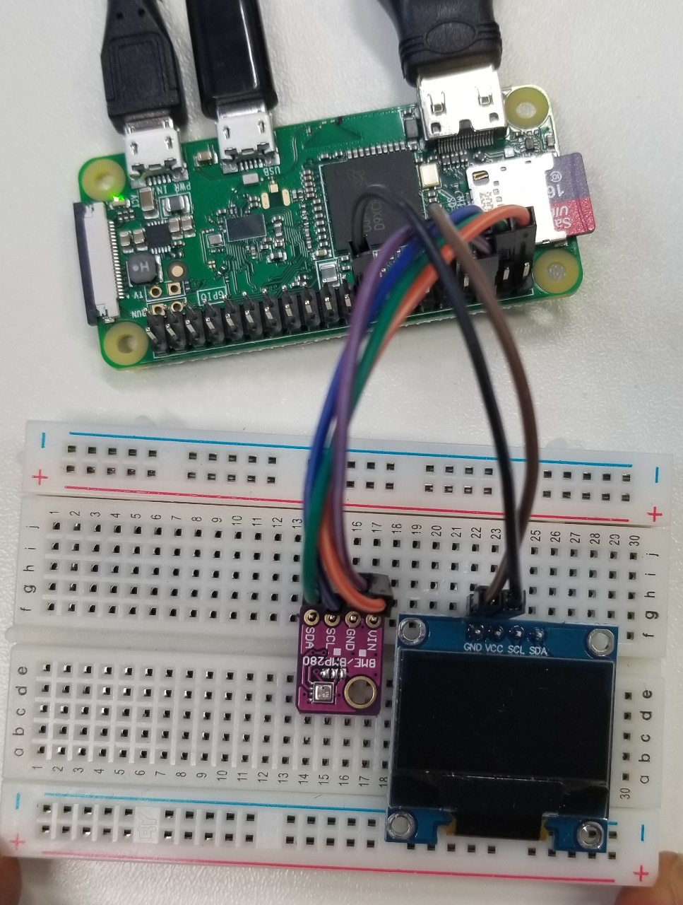
  
4. Use the male-male connection cables (2) to connect the SDA (e.g., on the “i” line) and SCL (e.g., on the “j” line) from the first device to the second device using the same line to close the circuit. Make sure a single line is used to connect each of the I2C pins. 

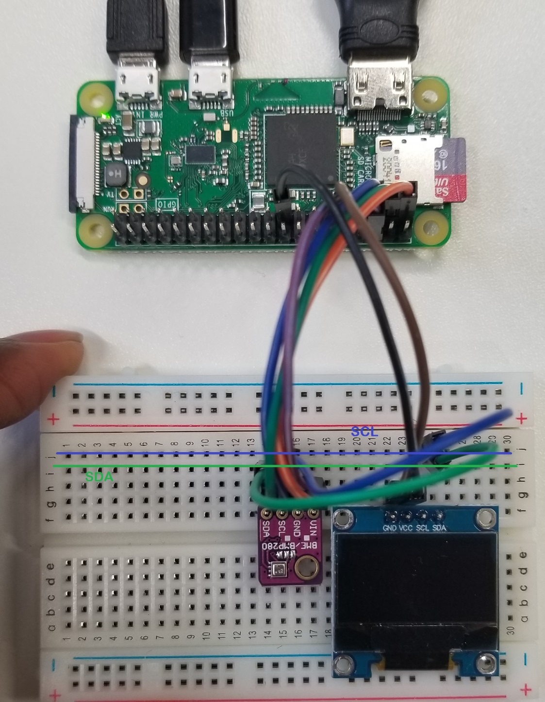

5. Check if all your device is connected by switching on the Raspberry Pi and run the following i2cdetect command to return the addresses for each of the devices on the terminal:

>> i2cdetect -y 1

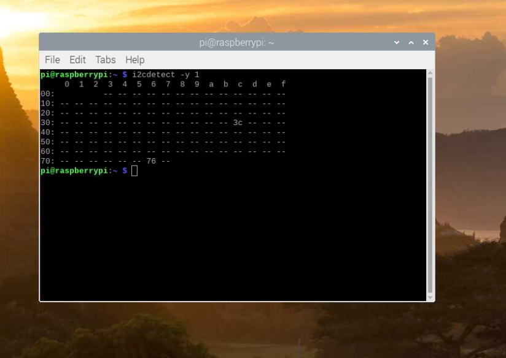

6. When everything works, you will see two addresses (0x76 for bme280 and 0x3c for OLED screen, or something similar). Write the address down for the next section. 

  
Python Script to Control the Devices
------------------------------------
  
In this section, we will now write our first python script to control the device. The latest Raspbian software has “Thonny python IDE” installed by default and we will use it in this exercise. Alternatively, other text editors can also be used to write the python script and execute from the command line. The Thonny python IDE can be accessed on Raspberry Pi through Menu > Programming > Thonny Python IDE

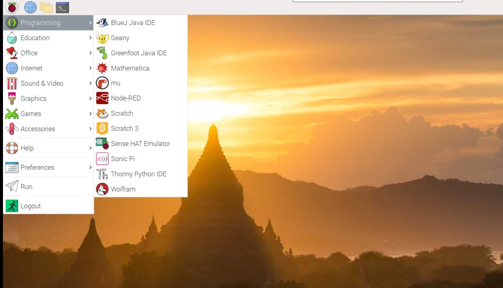

It has the code editor area (with some scripts displayed), shell or interpreter prompt and variable window to show your implemented variables. 

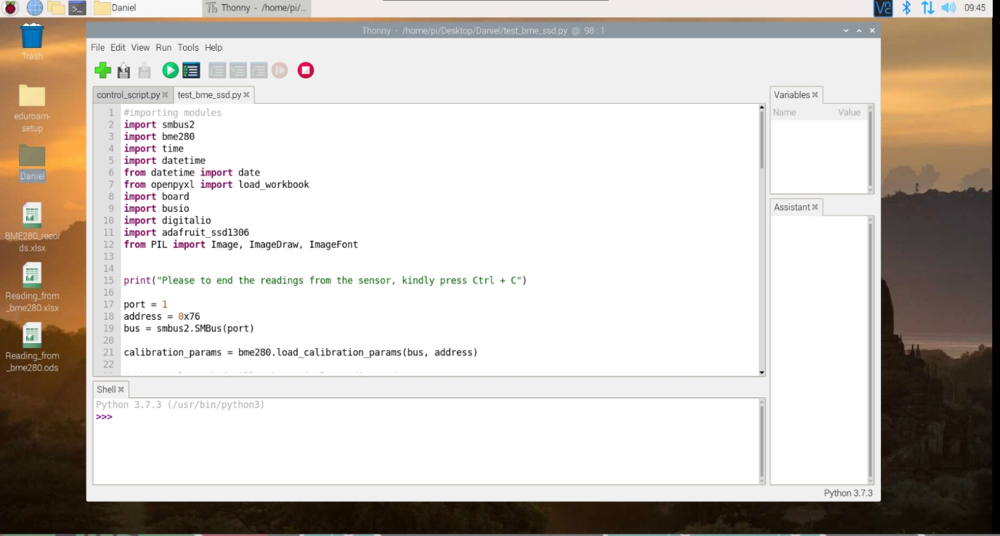

Now we will write a script that measures the atmospheric variables on a time interval (e.g., 1 minute interval), then store in a generated excel file and at the same time displays on the OLED screen with the time and date. Note that there are many ways to arrive at the same point in this exercise, therefore, you are allowed to adjust this script as you like. We will go through importing all the modules, calibrating sensor to take readings, setting OLED screen to display readings and saving the data in an excel sheet.   

.. literalinclude:: bme280_ssd1306_control_script.py

    
Your Task
---------

In groups of 2-4, assemble s simple measurement system using the Rasperyy Pi and sensors provided to you. Use your programming skills to implement a script that will measure and plot your data. Document your steps carefully on 1-2 pages. Diagrams and pictures may help with the documentation. 

Two student examples are given below:

:download:`Julias Hemmlig's Guide <Julia.pdf>` 

:download:`Noam Poremba's Guide <Noam.pdf>` 

In addition to your documentation, create simple time series plots of measurements you have taken.

.. warning::

    Late submissions won't be accepted!
