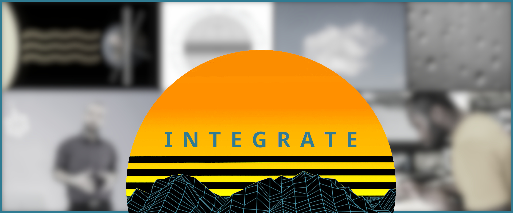

.. integrate documentation master file, created by
   sphinx-quickstart on Mon Jan 21 20:21:55 2019.
   You can adapt this file completely to your liking, but it should at least
   contain the root `toctree` directive.

INTEGRATE Lecture and Exercise Series
=====================================

The INTEGRATE (Integrated Teaching of Atmospheric Science, Technical/Computer Skills and Empirical Methods) teaching package covers the topics of physical climatology, empirical (statistical) methods and a hands-on approach of collecting atmospheric data and working with readily available climatological records. The development of this teaching package was supported by the EGU Higher Education Teaching Grant 2020 awarded to the primary author Sebastian G. Mutz.

For Teachers
------------
Teachers of the course are advised to :doc:`start here with our teacher guide <guide/guide>`. We support the use and further development of our materials by other teachers and thus release the course source code under a very permissive license on this `GitHub page <https://github.com/sebastian-mutz/integrate>`_. Please consult :doc:`our licensing and terms of use<general/license>` to make sure you are aware of all the possibilities you have with this package.

For Students
------------
Students can get an overview of the course in the :doc:`general information section<general/info>` and a more detailed overview of the learning goals and course contents in the :doc:`syllabus section<general/syllabus>`. 

    
Table of Contents
-----------------    
    
.. toctree::
   :maxdepth: 2
   :caption: Course Information:
   
   general/info
   general/syllabus
   general/license      
   general/credits         
  
.. toctree::
   :maxdepth: 2
   :caption: Lectures:
   
   lectures/info   
   lectures/A001/A001 
   lectures/A002/A002  
   lectures/A003/A003  
   lectures/A004/A004  
   lectures/A005/A005  
   lectures/A006/A006  
   lectures/A007/A007     
   lectures/A008/A008     
  
.. toctree::
   :maxdepth: 2
   :caption: Exercises:
   
   exercises/info   
   exercises/E001/E001
   exercises/E002/E002
   exercises/E003/E003
   exercises/E004/E004
   exercises/E005/E005
   exercises/E101/E101
   exercises/E102/E102
   exercises/E103/E103
   exercises/E104/E104   
   exercises/E105/E105      
   exercises/E201/E201         
   
.. toctree::
   :maxdepth: 2
   :caption: Projects:
   
   projects/P001/P001_info  
   projects/P002/P002_info
   projects/P003/P003_info
   projects/P004/P004_info
   projects/P005/P005_info
   projects/P006/P006_info
   projects/P007/P007_info   
   projects/P008/P008_info   
   projects/P009/P009_info       

.. toctree::
   :maxdepth: 2
   :caption: Resources:
   
   resources/dictionary
   resources/reading   
   
   
.. toctree::
   :maxdepth: 2
   :caption: Teacher Guide:
   
   guide/guide 
