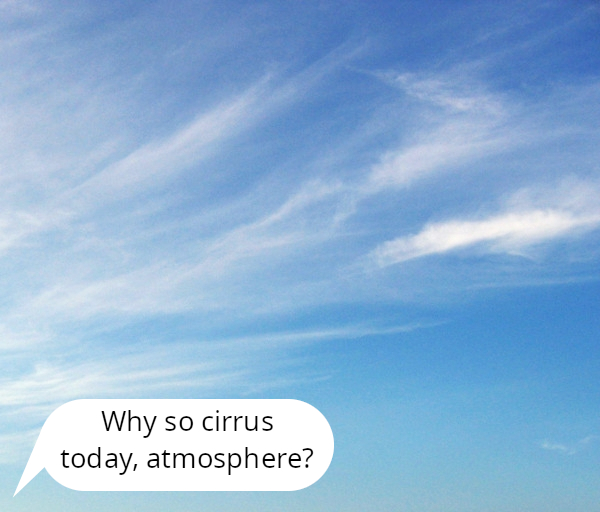
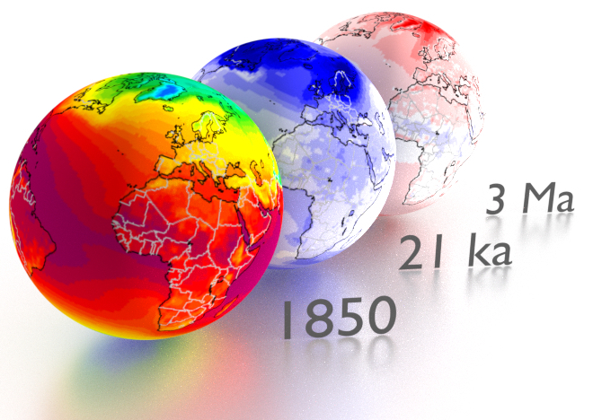
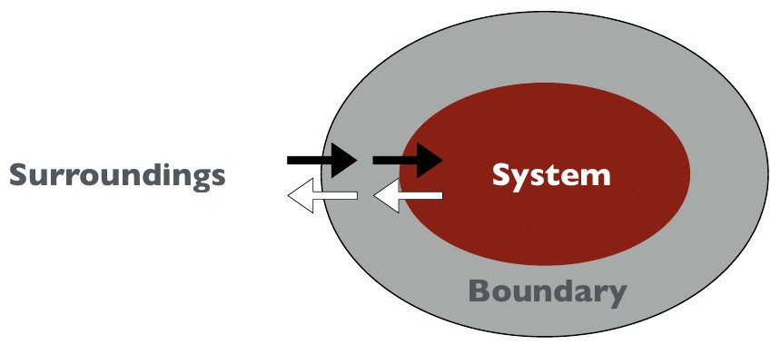
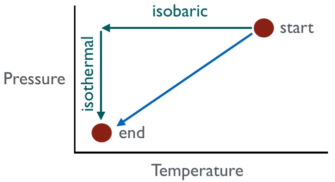
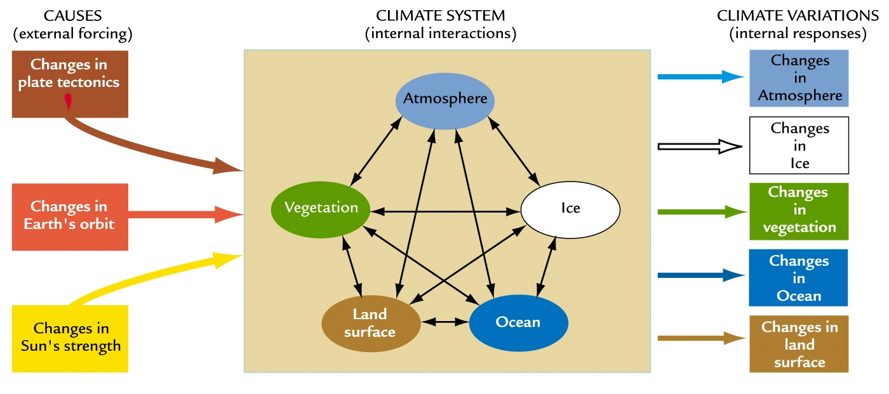
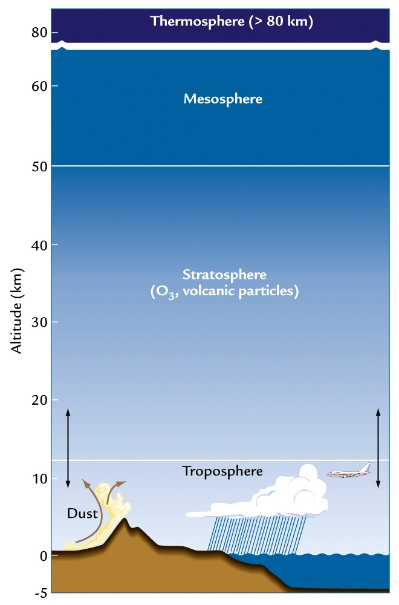
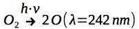
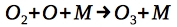
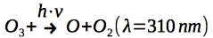

Building a Climate I
====================

**Retaining an Atmosphere**

This lecture introduces basic terminology and important units in climatology. Furthermore, we learn about how we are able to retain an atmosphere on Earth and other planets. Finally, we learn about the vertical structure of the atmosphere and why it exists.

Information
----------- 

+------------------------------------------------------+
| Learning goals                                       |
+======================================================+
| * Important definitions in climate science           |
| * How to retain an atmosphere?                       |
| * The vertical structure of the atmosphere           |
+------------------------------------------------------+

Definitions
-----------      

First, we will agree on the definitions of various terminology used in the course. This way, we ensure effective communication. In some cases, there is more than one valid definition, but the definitions used here do not significantly deviate (if at all) from other common definitions.

Weather
.......

   Cirrus clouds. [image: noaa.gov]

Intuitively, weather can be described as the relatively short-lived, temporary mood of the atmosphere at a specific location. More formally, weather can be described as the condition of meteorological processes at a specific location over a short time span.

**Informal definition** (intuitive): "The temporary mood of the atmosphere at a specific location"

**Formal defition** (one of many): “Condition of meteorological processes at a specific location over a short time span (usually a day)” [Kuttler W., 2013]

Climate
.......

Extending the analogy above to climate, we can say the following: If weather is the temporary mood of the atmosphere, climate can be regarded as the character of the atmosphere. While the character can be seen as the average set of moods you can have, it does determine probabilities of certain moods. 

   
   Temperature climatologies for a pre-industrial world (left), and temperature deviations from pre-industrial climatologies for the Last Glacial Maximum (middle) and mid_Pliocene (right) [data: Mutz et al., 2018].

**Informal definition** (intuitive): “The character of the atmosphere (that determines probabilities for different moods)"

**Formal defition** (one of many): “Summary of weather of a specific region over longer time scales (typically at least 30 years)” [Kuttler W., 2013]

We use the term **climatology** to refer to temporally averaged weather conditions. The standard averaging period to construct a climatology is 30 years, but it can vary depending on the purpose.

Systems
.......

   
The **system** is our object of study that consists of many processes and attributes. The **boundary** is where the system exchanges mass and/or energy with the **surroundings**. In climatology, this can be something as small as an air or water parcel, or something as comprehensive as the climate system. 

There are several models for systems:

* An **open system** allows mass and energy flow through the boundary. 
* An **isolated system** allows no mass or energy folw through the boundary. 
* A **closed system** allows energy, but no mass flow through the bounday.

   A thermos flask can be seen as an example of a closed, isolated or open system depending on its closeness to an idealised thermos flask and its current state (open or closed). How would you categorise a to-go cup?
    
An idealised thermos flask with a closed lid can be taken as an example of closd system, because neither mass nor heat is allowed to escape. For real (non-idealised) thermos flasks, we experience that the latter is not entirely true of course, since a lot of heat is allowed to flow through the boundary quite easily over the course of a day. We could therefore argue that a real (non-idealised) thermos flask should be categorised as an isolated system instead. Once you open the flask, you turn it into an open system, allowing exchange of mass and energy. 
 
.. note:: How would you categorise a to-go cup? How would you categorise a human?
 
     
Steady State
............

When **state variables** that define system behaviour or processes are not changing with time, we say that the system is in steady state or equibibrium. So we could write: 
   
.. math::

    \begin{equation}
      \frac {\delta p}{\delta t}=0
    \end{equation}
   
For system properties (or elements) **p**, the derivative with respect to time **t** is zero.

Systems can be in different types of steady state. If a system is in **static equilibrium**, all forces are balanced, there is no acceleration and all elements are at rest. If a system is in **dynamic equilibrium**, elements are not at rest, but processes are balanced, so that there is no net change over time.

System Paths
............

System paths are the paths taken, usually in the form of modification of the system attribute variables, to get from one equilibrium state to another. In this example, we go from an equilibrium state characterised by high temperature and pressure to an equilibrium state characterised by low temperature and pressure. The two possible paths shown on here are (1) decreasing pressure, then decresing temperature, and (2) simultaneously decreasing pressure and temperature. Path (1) includes an **isobaric** change, which involves no change in pressure, followed by an **isothermal** change, which involves no changes in temperature. 

.. note:: Can you think of more paths the system can take?

The Climate System
..................

Typically, the climate system on Earth includes the atmosphere, cryosphere, hydrosphere, biosphere and land surface. **Climate elements** are measurable meteorological quantities that can be statisticall processed with regard to the measurement period. They are the state variables of the climate system. **Climate factors** are influencing quantities that modify climate elements, and **climate forcings** are climate factors that drive/force/control climate elements from outside the climate system. Finally, we use the term **climate dynamics** to describe (1) effects of (external) forcings on the system or (2) forces and movements that characterise the system.

   
   The different parts of the climate system and how they interact.

.. note:: Discuss how the climate factors in the figure modify climate elements in the climate system.

Reminder: Units
--------------- 

For this course, we use the International System of Units. Before getting into any calculations for this course, let's remind ourselves of all relevant units. 

These include the 7 base units:

+----------+------------------------------+
|   unit   | abbreviation and explanation |
+==========+==============================+
| metre    | m, length/distance           |
+----------+------------------------------+
| kilogram | kg, mass                     |
+----------+------------------------------+
| second   | s, time                      |
+----------+------------------------------+
| ampere   | A, electric current          |
+----------+------------------------------+
| kelvin   | K, temperature               |
+----------+------------------------------+
| mole     | mol, substance amount        |
+----------+------------------------------+
| candela  | cd, light intensity          |
+----------+------------------------------+

You will frequently come accross the following derived units in this course and climate science in general:

+----------+------------------------------+
|   unit   | abbreviation and explanation |
+==========+==============================+
| Newton   | N (kg·m/s\ :sup:`2`\), force |
+----------+------------------------------+
| Pascal   | Pa (N/m\ :sup:`2`\), pressure|
+----------+------------------------------+
| Joule    | J (N·m), energy/work         |
+----------+------------------------------+
| Watt     | W (J/s), power               |
+----------+------------------------------+

**Note**: Outside of equations, this course uses **·** and **/** to denote multiplication and division respectively. In equations, you often see multiplication implied by concatenation of letters representing variables. This can be confusing when variable are represented by more than one letter. We therefore always explicitly use the multiplication signs in all equations for this course.

Retaining an Atmosphere
----------------------- 

Some may be familiar with the movie "Spaceballs", in which a shield around the planet prevents the atmosphere from escaping. Here, we explore why we do not need such a shield on Earth to prevent (too much of) the atmosphere from escaping. To understand how we can retain an atmosphere, we need to have a look at its composition and 2 important concepts: **molecular speed** and **escape velocity**.

Escape Velocity
...............

The escape velocity is the minimum speed required for a free object to escape from the gravitational influence of a massive body. It can be calculated as follows:

.. math::

    \begin{equation}
      v_e = \sqrt {\frac {2·G·M}{r}}
    \end{equation}

* G - the universal gravitational constant (G ≈ 6.67×10−11 m\ :sup:`3`\·kg\ :sup:`-1`\·s\ :sup:`-2`\). 
* M - the mass of the body to be escaped from.
* r - the distance from the center of mass of the body to the object.
* v\ :sub:`e`\  (Earth) =  11190 m/s

**Note**: solar winds also remove molecules; molecules bouncing into each other also speed up some

.. note:: Is escape velocity a property of the escaping object or the body that the object escapes from? Have a closer look at the equation to answer this. Can you calculate v\ :sub:`e`\  (Earth) on your own in Python or another language? How about v\ :sub:`e`\  (Mars)?

The Speed of Molecules
......................

The speed of molecules can be calculated as follows:

.. math::

    \begin{equation}
      v_m = \sqrt {\frac {3·k_b·T}{m}}
    \end{equation}

* v\ :sub:`m`\ - molecular speed
* k\ :sub:`b`\  - gas constant (8.314 kg·m\ :sub:`2`\/s\ :sub:`2`\·mol·K)
* T   - temperature 
* m   - mass (molecular)

**Note**: Interactions between molecules in the atmosphere can speed them up beyond what is calculated here.

.. note:: Examine the equation to infer the different controls for the speed of molecules.

Gases in the Atmosphere
.......................

* Nitrogen, N (78%) - no GHG
* Oxygen, O2 (21%) - no GHG
* Water vapour, H2O (<1%, up to 3% in parts of tropics)
* Carbon Dioxide, CO2 (0.04%, 400ppm)*
* Methane, CH4 (0.00018%, 1.85 ppm)*

.. note:: Calculate Earth's escape velocity and the speed of commonly occuring molecules and discuss.

Dissecting the Atmosphere
-------------------------

Layering
........

We use the following, common layering scheme for the atmosphere. It subdivides the atmosphere into Troposphere, Stratosphere, Mesosphere and Thermosphere.

   
.. note:: Do you know how the atmosphere is layered? By pressure? By temperature? Can you think of more ways to layer the atmosphere in a merited way?

Temperature-Defined Boundaries
...............................

We subdivide the atmopheric profile by air temperature, because boundaries more easily tied to specific heights than compositional boundaries. The figure shows a (very conceptual) vertical temperature profile of the atmosphere.

We will walk through the different layers and look at their attributes step-by-step.      
   
Troposphere
............

   
**Troposhpere fact sheet**:  

* Temperature decreases upwards with a gradient of dT/dz = -6.5 K/km.
* There is lots of vertical and horizontal mixing, high (but very variable) water vapor content.
* The lowest part (ca. 1km) is known as the PBL (planetary boundary layer).

**Tropopause**:

* The Tropopause is the upper boundary of troposphere, where main jet streams are.
* Tropopause height varies and is controlled by surface energy exchange. 
* It is highest at equator (ca. 17km) and lowest in polar regions (ca. 9km).
* It is not a continuous layer; there are multiple Tropopauses and “gaps” enable exchange of trace elements between troposphere and stratosphere.

.. note:: Think about the temperature lapse rate of -6.5 K/km. Can you confirm this with personal experiences?  

    
Stratosphere
............

   
**Stratosphere fact sheet**:   

* 8-17km to ca. 50km.
* Its lower part has a lapse rate of **dT/dz = 0 K/km**. Temperature remains fairly constant, so we can say it is isothermal. 
* Its upper part has a lapse rate of **dT/dz = 3 K/km**. temperature actually starts to increase again upwards. We call this the stratospheric thermal inversion.
* It has an Ozone concentration of ~320ppb. (The Troposphere only has ~34ppb).
* The Stratopause is the boundary between Stratosphere and Mesosphere and is marked by the temperature peak from the stratospheric thermal inversion.

.. note:: Think about what the Stratosphere's temperature profile means for vertical transport of air masses. Would you expect the stratosphere to be wet or dry?

**Stratospheric Thermal Inversion**:   

The thermal inversion, i.e. the upward warming, is related to Ozone. Below are the reactions involved:

* Photodissociation at wavelength of 242 nm (UV) follows:

* Ozone formation is facilitated by a 3 body collision reaction involving a third body **M**. This third body can, for example, be Nitrogen. Excess energy from the reaction is passed to **M**, which results in the heating of the upper Stratosphere. It follows:

  
* Ozone formation is balanced with its photodissociation at lower energy UV radiation (at wavelength 310 nm):

Mesosphere
..........

   
   
**Mesosphere fact sheet**:   

* 50km to 80/85km.
* Negative temperature lapse rate of **dT/dz = -3 K/km**.
* Temperature at top of Mesosphere is ~ 75°C to -90°C, the coldest in the atmosphere.

**Mesopause**

* It separates Mesophere from Thermosphere.
* It also separates homosphere (where gases are well mixed) from heterosphere (where gases start separating by mass).

.. note:: What conditions are required to see gases separating by mass?
   
Thermosphere and Exosphere
..........................

   
**Thermosphere**

* At ~100 km. 
* Extremely low pressure conditions (less than 0.0002 hPa). 
* Temperature can rise to 100s of °C, depending on solar radiation.

**Exosphere**

* It is the uppermost layer in atmosphere.
* It transitions into interplanetary space.    
   
   
   
   
   
   
   
   
   
   
   
   
   
