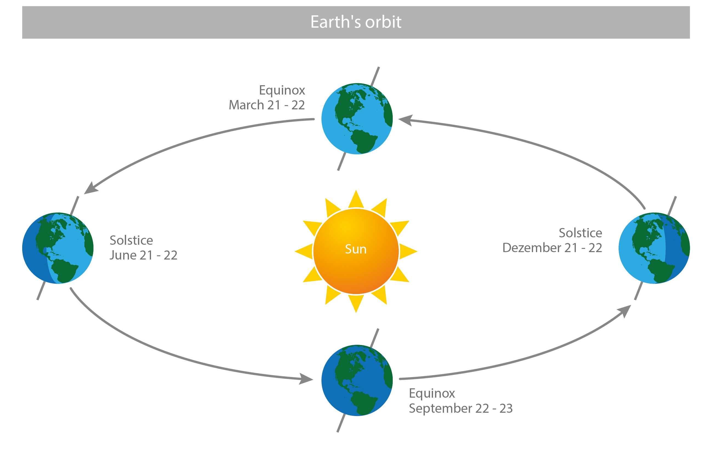
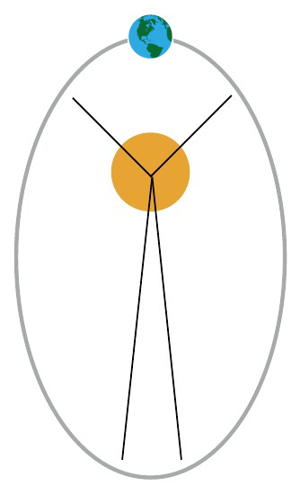
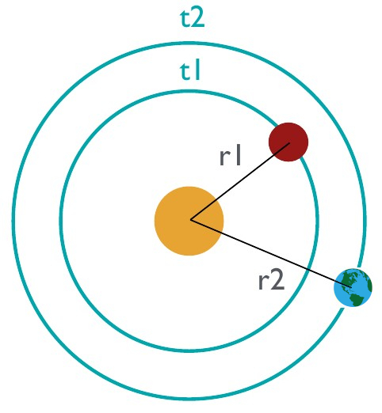
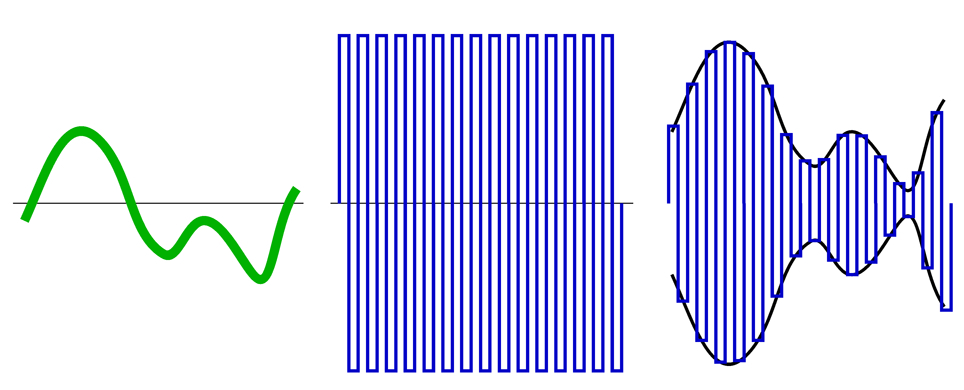

Building a Climate II
=====================

**Orbital Forcing**

This lecture introduces celestial mechanics, orbital forcing and climate variability on the ka (kiloyear) scale.

Information
----------- 

+------------------------------------------------------+
| Topics                                               |
+======================================================+
| * Understand orbital forcing of climate              |
| * How can we analyse ka-scale climate variability?   |
+------------------------------------------------------+

Celestial Mechanics and Orbital Forcing
---------------------------------------

Broadly speaking, **celestial mechanics** is concerned with the movements of objects in outer space. This includes the way planets orbit the stars like Earth is orbiting our sun. This is of particular interest to climatologists, because the nature and rhythms of the ways in which Earth orbits the sun changes the **solar radiation** that different regions on Earth receive in particular seasons. In turn, this redistribution of solar radiation creates very different climates. When climate is changed as a result of changing orbital parameters, we speak of **orbital forcing** of our climate. Note that these changes are slow and take place on **orbital time scales** of 10s to 100s ka. These changes happen at a higher frequency than changes on the **geological/tectonic time scale**, and at a lower frequency than changes on the **historical time scale** and **millenial/deglacial time scale**.

.. note:: Can you think of well known climate change events? On which time scales did they take place and how were they forced?

Kepler's Laws of Planetary Motion
---------------------------------

Kepler's Laws of Planetary Motion, published by Johannes Kepler in the 1600s, describe how planets orbit the sun. Before we get into any details, let's recall the general set-up of Earth's orbit around the sun.

   
   The Earth's orbital path around the sun. Its current tilt is ~23.5°, the 2 equinoxes occur on March 21-22 and September 22-23, and the 2 solstices occur on June 21-22 and December 21-22. [image: cc-by Lisa Rauschenbach]

The current tilt of the Earth's axis (the angle between its rotational axis and orbital axis) is ~23.5°. The equinox, roughly translating from latin as "equal night", marks the date(s) when nighttime and daytime duration are approximately equal. The solstice marks the date(s) when the sun appears to reach its most northern/southern position and the longest day (in case of the summer solstice) or shortest day (in case of the winter solstice) in the year is experienced at a particulat location that does not lie on the equator. The term roughly translates from latin as "the sun stands still", because it appears to stop migrating north/south before it reverses its direction.   

.. note:: Can you explain why the sun appears to migrate north/south at a particular location during the course of a year?
   

First Law of Planetary Motion
.............................

.. figure:: img/kepler01.jpg  
   :figwidth: 200px
   :width: 200px
   :align: left

   Earth's (very exaggerated) elliptical path around the sun with perihelion and aphelion marked on it.
   
**Orbits are ellipses with the sun at one of its two foci.**

Elliptical orbits come with a few additional properties that are relevant to **eccentricity**, i.e. the measure of how elliptical the planet's path is. **Apoapsis** and **periapsis** are the points in the path of the orbiting body that are (respectively) farthest away and nearest to the centre of mass of the system. On the other hand, **aphelion** and **perihelion** are the points in the path of the orbiting body that are (respectively) farthest away and nearest to the body (sun) they orbit. 

Eccentricity is determined by distance between foci and describes amount by which an object’s orbit deviates from a perfect circle. It can be described as follows:  
   
.. math::

    \begin{equation}
      e=\frac {r_a-r_p}{r_a+r_p}
    \end{equation}

In the above equation, e is the eccentricity, r\ :sub:`a`\ is the radius at apoapsis and r\ :sub:`p`\ is the radius at periapsis. The value for e describes the amount by which an object’s orbit deviates from a perfect circle, where 0 denotes a circular orbit and 1 would be a parabolic escape orbit.

.. note:: Earth's averade distance to the sun is ~155.5e6 km. Do you know its extremes (perihelion and aphelion)? Can you calculate the Earth's current eccentricity? Is its path around the sun highly elliptical or closer to a circle? Does this evaluation match what you found out about the minimum and maximum (perihelion and aphelion) distances between Earth and sun?

    
Second Law of Planetary Motion
..............................

   
**A line joining planet and sun sweeps out equal areas during equal time intervals.**

If you imagine a line joining the planet and the sun as the planet orbits around the sun, the area it sweeps up on the orbital plane remains constant per unit of time. Consider the implications of the above when we have an elliptical path around the sun: Rotational speed near sun must be greater than farther away from the sun. Since Earth is closest to the sun (in perihelion) in northern hemisphere winter/southern hemisphere summer (January), it means that northern hemisphere winter/southern hemisphere summer is shorter than northern hemisphere summer/southern hemisphere winter. 
   
.. note:: What would happen to northern hemisphere winter/southern hemisphere summer if we made Earth's path more elliptical?   
   
Third Law of Planetary Motion
.............................

**The square of orbital period of a planet is proportional to cube of semi-major axis of its orbit.**
   
This law can also be described as: 
   
.. math::

    \begin{equation}
      \frac {r_1^3}{t_1^2} = \frac {r_2^3}{t_2^2} = constant for planets
    \end{equation}

In the equation above, r\ :sub:`1`\ and t\ :sub:`1`\ represent the semi-major axis and orbital period of planet 1 (e.g. Mars) and  r\ :sub:`2`\ and t\ :sub:`2`\ represent the semi-major axis and orbital period of planet 2 (e.g. Earth).

.. note:: Look up the distances and orbital periods of Earth and Mars. Can you confirm this law? Can you imagine how this could be related to Newton's Law of gravitation?
    

Milankovich Cycles
------------------

The cyclical variations in orbital parameters, namely eccentricity, obliquity/axial tilt and precession result in cyclical variations in solar radiation reaching the Earth. These have significant influences on climate over geological time scales. We refer to those cycles as Milankovich Cycles. The term **orbital forcing** in climate science usually refers to forcing by variation in these 3 parameters.

Terminology
...........

It is important to familiarise ourselves with some terminology and concepts so we can understand the interplay between orbital parameters and how Milankovich cycles can result in very different climates. These include: 
      
* Cycle - return of signal with consistent amplitude and period.
* Period - wavelength, SI unit: s.
* Amplitude -  amount by which cycles deviate from long term mean.
* Modulation - varying the properties (e.g. amplitude) of cycles.

   
   Example of amplitude modulation: The modulating wave (left) modulates the carrier wave (middle) to produce the modulated result (right).

Amplitide and frequency modulation are commonly used in radio and audio technology, music production and engineering. It is the concept of amplitude modulation that helps us understand said interplay, because **precession** is modulated by **eccentricity** in the same manner. We will have a look at these parameters in more detail now.
   
   
Eccentricity
............

Eccentricity describes the degree to which the orbital elliptical path of a planet deviates from a perfect circle (see Kepler's First Law of Planetary Motion). 

Earth's eccentricity has **2 cycles at 100 ka and 413 ka**.

.. note:: What does a highly elliptical path mean for solar radiation received by a particulat region in the northern or southern hemisphere? Think back to the general set-up of Earth's orbit around the sun.

Obliquity
.........

Obliquity or **axial tilt** describes the angle between a planetary object's rotational axis and orbital axis, which also the angle between the equatorial plane and orbital plane. Earth's current axial tilt is ~23.5°, but it **oscillates between 22.2° and 24.5° with a very regular cycle of 41 ka**.

.. figure:: img/tilt_ccby_SebastianMutz.jpg  
   :align: center
   
   The thick white line (orbital axis) is perpendicular to the orbital plane of Earth. (In this 2D figure, the orbital plane could be represented by a line joining the centre of Earth and sun). The thin white line represents the rotational axis of Earth and the dashed line the equatorial plane (here in in 2D). The axial tilt is the difference between the thick and thin white line, or the difference between the equatorial and orbital plane. [image: cc-by Sebastian Mutz]

.. note:: Consider the figure. What implications would a change in axial tilt have on northern/southern hemisphere winter/summer? 
 
Axial Precession ("Wobble")
...........................

   
   Axial precession or "wobble" can best be visualised by the change in direction of the spinning axis of a spinning top when it begins to wobble as it slows down.

Imagine turning a spinning top (toy). If you give it a good spin, its rotational axis remains upright and shows little or no changes in inclination. As it begins to slow down, the spinning top begins to wobble. In other words, it changes its axial tilt as well as the direction of the rotational axis. For planetary bodies, the latter parameter is called **axial precession** - it is the change in direction of axial tilt, but not the change in tilt itself. Earth's precessesion has **1 strong cycle at 23 ka and 1 weaker cycle at 19 ka**.

**How do we quantify this?**
If we transfer this concept into the setup of our solar system, the results are changes in the positions of solstices and equinoxes in Earth’s elliptical path. This is represented by sin ω (values from +1 to -1), where ω is the angle between vernal equinox (20. March) and perihelion.  11 ka from now (half a precession cycle), December will be in aphelion.

.. figure:: img/orbit002_ccby_LisaRauschenbach.jpg  
   :align: center
   
   Axial precession ("wobble") is represented by sin ω, where ω is the angle between vernal equinox (20. March) and perihelion. [image: cc-by Lisa Rauschenbach]

.. note:: Consider the interplay between precession and changes in the elliptical nature of Earth's orbital path. Can you see why precession would be **modulated** by eccentricity?

Milakovich Cycles Summary
.........................

* **Eccentricity** is the deviation from perfectly circular orbital path of of astronomical body around another. Earth has cycles of 413ka - 100ka.
* **Obliquity** is the axial tilt (angle between rotaional and orbtial axis). It causes in phase changes in polar regions in both hemispheres. Higher tilt amplifies seasons at poles and expressions of tilt changes are more pronounced at the poles. Earth has a very regular 41 ka cycle. 
* **Axial precession** ("wobble") is the orientation change of the rotational axis. It causes out of phase changes between hemispheres for their seasons. It is modulated by eccentricity and the expressions of precession and eccentricity changes are more pronounced in lower latitudes. Earth has a strong cycle of 23 ka and a weaker cycle of 19 ka.

Detecting Orbital Forcing
-------------------------

.. note:: The article "Trends, Rhythms, and Abberations in Global Climate 65 Ma to present" by Zachos et al. (2001) investigate different time periods in the geological past with respect to orbital forcing. It makes a good case study for topics covered in this lecture and demonstrates how to detect orbital forcing in a palaeoclimate time series. It allows for good discussion of the topic in class.
   
   
   
