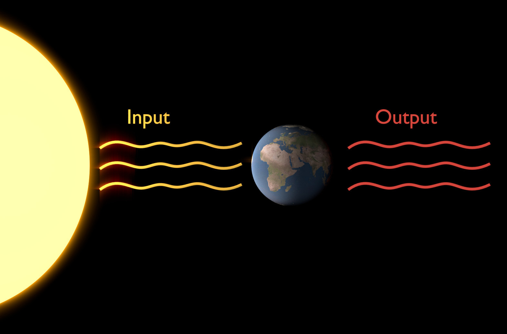

Building a Climate III
======================

**Radiative Fluxes**

This lecture introduces radiative fluxes and the influence of insolation, albedo and greenhouse gases on average planetary temperatures. After this lecture, you should be able to predict average temperature of planets and understand why this is possible.

Information
----------- 

+-------------------------------------------------------------------------------+
| Learning goals                                                                |
+===============================================================================+
| * Gain quantitative understanding of radiative fluxes in the atmosphere       |
| * Understand influence of insolation and greenhouse gases on mean temperature |
+-------------------------------------------------------------------------------+

Black Body Radiation
--------------------

   
   The concept of black body radiation is essential in understanding radiative fluxes (the input and output) of Earth. Specifically, it lets us calculate the nature of incoming and outgoing radiation, as well as the mean global temperatures on Earth or any planet if the whole system is in equilibrium.

A **black body** is an idealised opaque, non-reflective object or system that absorbs all incident radiation and re-radiates energy. **Black body radiation** is the electromagnetic radiation emitted by a black body (that is in thermodynamic equilibrium with its environment). Its spectrum of of wavelengths depends only on the body's temperature. The characteristics of black body radiation are therefore only dependent on the system's attributes (temperature) rather than the nature of previously absorbed radiation. The concept of black body radiation is central in understanding the important radiative fluxes of the climate system and global mean temperatures on Earth. 

Wien's Law
..........

In case of black body radiation, an increase n temperature causes higher emission of radiation of all wavelenghts, but esp. for short wavelength radiation. Therefore, the radiation peak on the wavelength spectrum shifts as temperature changes. This is described by Wien's Law, which states that the emission curve (see figure) peaks at different wavelengths inversely proportional to temperature:

.. math::

    \begin{equation}
      \lambda_{max} = \frac {C}{T}
    \end{equation}

In the equation above:

* \ :math:`\lambda_{max}` \ - the maximum wavelength
* c - proportionality constant; ca. 2.897·10\ :sup:`-3`\
* T - temperature

Two important peaks to remember for the climate system on Earth are:

.. math:: \lambda_{max(sun)} \approx 0.49 \mu m
   
.. math:: \lambda_{max(earth)} \approx 0.49 \mu m
        
    
Stefan-Boltzman Law
....................

Stefan-Boltzman Law describes the total energy radiated per unit time per surface area of a black body *across all wavelengths*. It can be calculated as follows:

.. math::

    \begin{equation}
      \frac {power}{area} = \sigma · T^4
    \end{equation}    

Sigma (\ :math:`\sigma` \) is the Stefan-Boltzman constant. \ :math:`\sigma = 5.670373 · 10^{-8}Wm^{-2}K^{-4}` \. We will later make use of this equation to calculate the mean global temperature of Earth.

The Solar Constant
------------------

The solar constant (E\ :sub:`0`\) is the radiation intensity that hits the outer atmosphere of Earth and thus an important parameter to remember in climatology. \ :math:`E_0 \approx 1380Wm^{-2}` \, but let's take a step back and see where that number comes from. To unterstand where the number comes from, let's go back to the source of it all: the sun. The sun fuses 4H (H for Hydrogen) to He (Helium), and the resulting mass deficit is resolved by releasing radiation - solar electromagnetic radiation we call \ :math:`\Phi_{sol}` \. \ :math:`\Phi_{sol} \approx 3.9 · 10^{26} W` \.

Sun rays "spread out" into space and radiation becomes less as an inverse square law.    
   

.. figure:: img/radFlux004_ccby_SebastianMutz.jpg  
   :figwidth: 400px
   :width: 400px
   :align: left

.. math::

    \begin{equation}
      E_0 = \frac { \Phi_{sol} }{ 4·\pi·R^2 }
      = \frac { 3.9·10^{26} W }{ 4·\pi·(1.5·10^{11} m)^2 }    
      \approx 1380 Wm^2
    \end{equation}          

    
.. figure:: img/radFlux003_ccby_SebastianMutz.jpg  
   :align: center
   
    
.. math::

    \begin{equation}
      radiation_{intercepted} = E_0 · \pi · r^2_{earth}
    \end{equation}          
 

Albedo
------

.. math::

    \begin{equation}
      radiation_{absorbed} = E_0 · \pi · r^2_{earth} · (1-\alpha)
    \end{equation}              

    
Calculating Temperature on Earth
--------------------------------

.. math::

    \begin{equation}
      E_0 · (1-\alpha) = 4 · \sigma · T^4_{earth}
    \end{equation}                  
    
    
.. math::

    \begin{equation}
      T_{earth} = \sqrt[4] { \frac {E_0 · (1-\alpha)} {4 · \sigma}}
      =  \sqrt[4] { \frac {1380 Wm^{-2} · (1-0.33)} {4 · 5.67 · 10^{-8} Wm^{-2}K^{-4} }}
      \approx 252K
    \end{equation}     
    
.. note:: Do you know the mean global temperature on Earth? How does this compare to our estimate?    
    

Greenhouse Effect
-----------------

If you converted our estimate of 252K mean global temperature to more commonly used units of °C (subtract 273.15), you may have noticed that our estimate seems a tad cool. You would be right about that, because:

.. math:: T_{earth(predicted)} \approx 252K
.. math:: T_{earth(actual)} \approx 288K

The actual temperature on Earth is about 36K warmer - this makes Earth more habitable for most of the current fauna and flora. The difference comes from one important factor we neglected in our calculation of mean global temperature: greenhouse gases. 

   
   Greenhouse gases are the reason Earth is approximately 36K warmer than we would expect the planet to be without an atmosphere (that contains such gases). They absorb radiation and emit some of it back to the planet's surface.

A **greenhouse gas** (**GHG**) is a gas that can absorb and emit infrared radiation. Molecules that have a dipole moment can absorb and emit radiation. Important GHGs on Earth include:

* H\ :sub:`2`\O - a strong absorber in 5.5-7µm range and > 27µm.
* CO\ :sub:`2`\ mostly absorbs thermal infrared radiation.
* O\ :sub:`3`\ strongly absorbs radiation in the UV spectrum.

Atmospheric Transmissivity and Opacity
--------------------------------------

