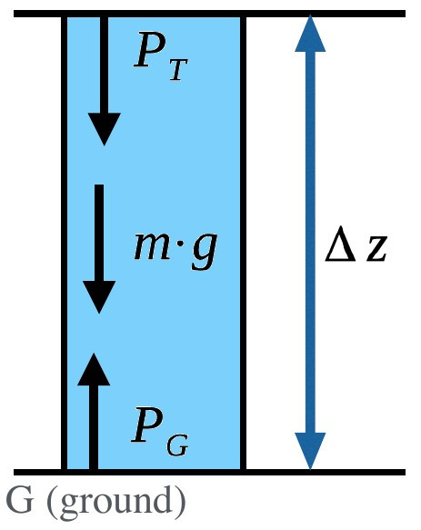

Building a Climate IV 
=====================

**Pressure and Buoyancy**

This lecture explores the topics of atmospheric pressure, buoyancy and vertical transport in the atmosphere.

Information
----------- 

+--------------------------------------------------------------+
| Learning goals                                               |
+==============================================================+
| * Understand partial pressure and the ideal gas law          |
| * Understand drivers of vertical transport in the atmosphere |
+--------------------------------------------------------------+

Atmospheric Pressure
--------------------

Before we explore any specifics, we familiarise ourselves with a few important concepts related to pressure.

Partial Pressures
.................

.. figure:: img/pressure01.jpg  
   :figwidth: 300px
   :width: 300px
   :align: left
   
   Mixture of two gases represented by blue and red elements.

Partial pressure is the pressure that an individual gas exerts in a mixture of gases. Temperature eqiulibrates quickly, so that

\ :math:`T_{red} = T_{blue}` \ 

in a mixture of two gases represented by blue and red molecules in the figure. The total pressure is the additive of partial pressures so that 

\ :math:`P_t=P_{red}+P_{blue}` \ 

in our mixture of the two gases.

.. note:: Do you remember the chemical composition of the air (gas) mixture?

Ideal Gas Law
.............

.. figure:: img/pressure02.jpg  
   :figwidth: 300px
   :width: 300px
   :align: left

We can use the ideal gas law to solve many climatological or meteorological problems that involve (ideal) gases in a mixture:

\ :math:`P · V = n · \bar{R} · T` \
   
The meaning of individual terms is listed here:
   
* \ :math:`P` \ - pressure   
* \ :math:`V` \ - volume of the container   
* \ :math:`n` \ - number of moles/amount of substance   
* \ :math:`\bar{R}` \ - universal gas constant
* \ :math:`T` \ - temperature   

Mass Density
............

The mass density or mass per volume for a gas mixture can be written as:

.. math:: 

    \begin{equation}
      \rho = \frac {n · M} {V}
    \end{equation}     

where:

* \ :math:`\rho` \ - mass density ("air density" in most of our cases)   
* \ :math:`n` \ - number of moles/amount of substance   
* \ :math:`M` \ - molecular weight
* \ :math:`V` \ - volume
    

Specific Gas Constant
.....................

If we put the universal gas constant in relation to moleculat weight, we can calculate the specific gas constant:

.. math:: 

    \begin{equation}
      R = \frac {\bar{R}} {M}
    \end{equation}     

where:

* \ :math:`R` \ - specific gas constant
* \ :math:`\bar{R}` \ - universal gas constant
* \ :math:`M` \ - moleculat weight
    
"Air"
.....

Air is a mixture of gases. It is well mixed and does not change with latitude, so that we can safely assume the following composition and the gases' contribution to air's volume and mass:

+--------------+------------------------+------------------------+
|      gas     | contribution to volume | contribution to mass   |
+==============+========================+========================+
| N\ :sub:`2`\ |          78%           |            75.5%       |
+--------------+------------------------+------------------------+
| O\ :sub:`2`\ |          21%           |            23.2%       |
+--------------+------------------------+------------------------+
| Ar           |          0.9%          |            1.3%        |
+--------------+------------------------+------------------------+

These are the major contributors to volume and mass. Additionally, there are several important trace gases that do vary in concentration much more (in time and space):

+----------------+------------------------+
| trace gas      | contribution to volume |
+================+========================+
| H\ :sub:`2`\ O | 1%-4% near the surface |
+----------------+------------------------+
| CO\ :sub:`2`\  | 400 ppm +/- 5%*        |
+----------------+------------------------+

Note: CO\ :sub:`2`\  concentrations are rapidly changing due to human activity.

The composition of "air" leads to its commonly used attributes:

.. math:: M_{air} \approx 29

.. math:: R_{air} \approx 287 Jkg^{-1}K^{-1}

Ideal Gas Law (modified)
........................
   
From our knowledge of the computation of mass density and the specific gas constant, we can rewrite the ideal gas law as follows:   
   
.. math:: 

    \begin{equation}
      P = \rho · R · T
    \end{equation}        
   
where:

* \ :math:`P` \ - pressure   
* \ :math:`\rho` \ - mass density ("air density" in most of our cases)   
* \ :math:`R` \ - specific gas constant (gas constant for the gas in question)
* \ :math:`T` \ - temperature

In meteorological and climatological practice, this is a more useful form. It allows us to easily calculate pressure based on known parameters. For example:

.. math:: T \approx 19°C = 292.15 K      
.. math:: R \approx 287 Jkg^{-1}K^{-1}   
.. math:: \rho \approx 1.2985 kgm^{-3}        

As we established before, \ :math:`\rho` \ and R do not change much for air. We can therefore calculate (tropospheric) air pressure based on temperature quite easily as follows:

.. math:: 

    \begin{equation}
      P_{troposphere} = 1.2985 kgm^{-3} · 287 Jkg^{-1}K^{-1} · 292.15 K 
      \approx 108900 Pa
    \end{equation}           
   
Buoyancy
--------

To understand vertical transport, mixing and precipitation formation in the atmosphere, we need to first familiarise ourselves with the buoyancy force.
   
   
Buoyancy Force
..............

   
   In a fluid in a gravity field,pressure increases with depth. The pressure exterted on an immersed object is higher at the bottom of that object than at the top of that object.

The buoyancy force is a pressure force acting on an object immersed in a fluid in a gravity field. In a fluid in a gravity field, such as a water tank on the Earth's surface, pressure increases with depth. The pressure exterted on an immersed object is higher at the bottom of that object than at the top of that object. The net result is an upward (against gravity) force exerted on the immersed object. This buoyancy force is the same force you experience that seems acts against your efforts to push an inflated ball into a water tank.
 

   
   Archimede's Principle: The upward buoyant force equals the weight of the fluid that is displaced by the immersed object. 

This raises the next question: How do we actually calculate buoyancy?   
   
**Archimede's Principle** states that the upward buoyant force equals the weight of the fluid that is displaced by the immersed object. We therefore need to know the gravitational acceleration and can write:

.. math:: 

    \begin{equation}
      B = V · \rho · g
    \end{equation}           

where:    
    
* \ :math:`B` \ - buoyancy force
* \ :math:`V` \ - volume of object
* \ :math:`\rho` \ - density of fluid
* \ :math:`g` \ - gravitational acceleration

Buoyancy Force: Example I
.........................

An **air parcel** is an imaginary body of air with approximately uniform properties. It is a concept frequently used in atmospheric sciences. The analogue in hydrological sciences is a **water parcel**. Typically used attributes of an air parcel include the parcel's pressure(\ :math:`P_p` \), temperature(\ :math:`T_p` \) and density(\ :math:`\rho_p` \). We denote the same attributes for the environment as \ :math:`P_e` \, \ :math:`T_e` \ and \ :math:`\rho_e` \ respectively. Since pressure equalises quickly in the atmosphere (and more quickly than temperature), we will assume that \ :math:`P_p = P_e` \ for this example. 
   
Now consider the following scenario:   
   
.. figure:: img/buoyancy04.jpg  
   :figwidth: 350px
   :width: 350px
   :align: left   

We know the temperature and pressure of parcel and environment, but do not know the density of them. The pressure for environment and parcel is 101000Pa, and temperatures are 288K and 278K for parcel and environment respectively. However, we need to know the densities to computer the gravitational and the buoyancy force acting on the parcel. 

The buoyancy ("upward") force is related to the density of the environment:   
   
\ :math:`B = V · \rho_e · g` \

The "downward" force is related to the density of the parcel:      

\ :math:`F_g = V · \rho_p · g` \
  
Once this parcel of air has equilibrates pressure with its environment, which happens very rapidly, the parcel density will be lower, buoyancy will be greater, a net "upward" force is the result and the air parcel rises. If the air parcel were cooler, the opposit would happen.

Consider our version of the ideal gas law:

.. math:: 

    \begin{equation}
      P = \rho · R · T
    \end{equation}     

We can rearrange it to solve for density. We can then use the known temperatures and pressure of the environment and air parcel to calculate the density of the environment and air parcel respectively:
    
.. math:: 

    \begin{equation}
      \rho_{e} = \frac {P_e} {R · T_e} 
      = \frac {101000 Pa} {287 Jkg^{-1}K^{-1} · 278 K} 
      = 1.266 kgm^{-3}
    \end{equation}         

    
.. math:: 

    \begin{equation}
      \rho_{p} = \frac {P_p} {R · T_p} 
      = \frac {101000 Pa} {287 Jkg^{-1}K^{-1} · 288 K} 
      = 1.222 kgm^{-3}
    \end{equation}             

We can then use these densities to calculate the gravitational and buoyancy force acting on the parcel.              
    
    
    
Buoyancy Force: Example II (changing chemistry)
...............................................

For example II, we consider a very similar setup. However, this time our air parcel consists of Helium and we assume no mixing with the environment is possible (as would be the case for a Helium balloon). We will still assume that \ :math:`P_p = P_e` \. Additionally, we will assume that \ :math:`T_p = T_e` \. 

So what changes? Helium has a different specific gas constant than the "air" mixture. What does that mean for the density of the parcel and the environment?

Let's have a look at how we would compute the density of the environment and parcel using the ideal gas law:

.. math:: 

    \begin{equation}
      \rho_e = \frac {P_e}{R_{air} · T_e}
    \end{equation} 

On the other hand, the density of the parcel is 

.. math:: 

    \begin{equation}
      \rho_p = \frac {P_p}{R_{Helium} · T_p}
    \end{equation} 
    
So even though we have equal pressures, we have differing densities due to different specific gas constants. These are different due to different molecular weights.
    
.. note:: Look up the molecular weight and specific gas constant for Helium. Can you calculate the density of the environment and air parcel? Goes a greater molecular weight result in a net upward or downward force?

Pressure and Altitude
---------------------

In the last part of the lecture about pressure, we investigate how it varies with altitude. In most cases, it is approximated with the concept of hydrostatic pressure.

Barometric Formula
..................

The most common way to appximate pressure at a specific height is by application of the so-called Barometric Formula. It can be written as:

.. math:: 

    \begin{equation}
      P_h = P_0 · e ^{- \frac {h · m · g} { \bar{R} · T} } 
    \end{equation}           

where:    
    
* \ :math:`h` \ - altitude above surface
* \ :math:`P_h` \ - pressure at height h
* \ :math:`P_0` \ - pressure at sea level
* \ :math:`m` \ - molecular mass (of air)
* \ :math:`g` \ - acceleration due to gravity
* \ :math:`\bar{R}` \ - universal gas constant
* \ :math:`T` \ - temperature
    
.. note:: What pressure do you expect at the lowest and heighest altitude in the area you live in?
    
Hydrostatic Balance
...................

   
   In a column of air with no vertical acceleration, the downward and upward forces are balanced. In this case, the column reaches the top of the atmosphere where pressure is negligible.

Imagine a column/cylinder extracted from the atmosphere for consideration. The weight of the atmosphere (\ :math:`m · g` \) acting downward can be balanced with the force acting upward (\ :math:`P · A` \). This assumption is called the **hydrostatic equilibrium** or **hydrostatic balance** and can be assumed when there is no vertical acceleration. Note that this cannot be assumed when the fluid (air) is not rest and we observe vertical acceleration. The assumption of hydrostatic equilibrium is therefore problematic in mountain regions. However, for most other cases we can assume this balance:
 
.. math:: 

    \begin{equation}
      P · A = m · g
    \end{equation}           

and:    
    
.. math::     
    \begin{equation}
      \frac {P} {g} = \frac {m} {A}
    \end{equation}               
    
where:

* \ :math:`m` \ - mass
* \ :math:`g` \ - gravitational acceleration
* \ :math:`P` \ - pressure at the ground
* \ :math:`A` \ - area of cylinder
    

   
   For more common problems concerning a specific section of the atmosphere, we need additional terms in our equation.
    
Note that in the above example, we assumed the atmospheric column reached into space, so that the top of the column represented the top of the atmophere, where pressure was negligible. A more useful form for common problems and a specific section of the atmospheric column is: 

.. math::     
    \begin{equation}
      P_G - P_T = \rho · \Delta z · g
    \end{equation}               
    
where:

* \ :math:`P_T` \ - pressure at the top
* \ :math:`P_G` \ - pressure at the ground
* \ :math:`\rho` \ - density
* \ :math:`\Delta z` \ - change in height    
* \ :math:`g` \ - gravitational acceleration    
    
