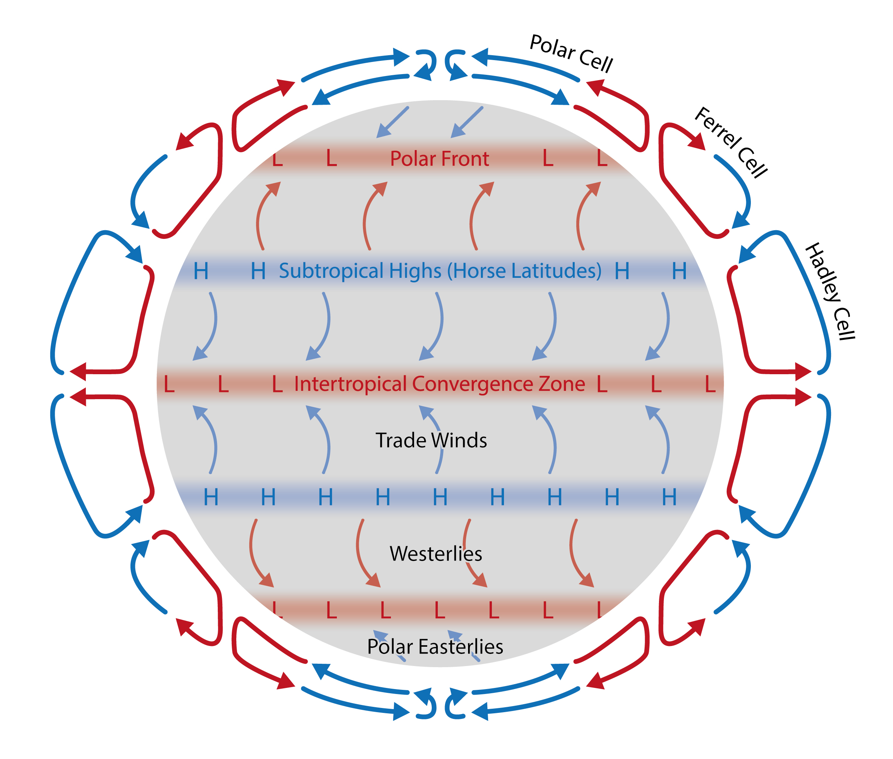

Building a Climate VI
=====================

**Atmospheric Circulation**

We have previously looked at vertical transport and radiative fluxes. Here, we will explore horizontal transport and how differential heating and heat transport control atmospheric circulation.

Information
----------- 

+------------------------------------------------------+
| Topics                                               |
+======================================================+
| * Understand drivers of atmospheric circulation      |
| * Gain an overview of Earth's circulation structure  |
+------------------------------------------------------+

Differential Heating and Heat Transport
---------------------------------------

   
   The equatorial regions receive more radiation than the polar regions. The equatorial regionals are also emitted more than the polar regions, because they are warmer. This results in a net deficit in the polar regions, which is resolved by heat transport from the lower to the higher latitudes.

We previously touched on the interplay between solar irradiation and the Earth's geometry. This leads to differential heating of the planet. More specifically, the incoming solar radiation at the higher latitudes (near the poles) is spread over larger areas than at lower latitudes (near the equator). This results in lower latitudes receiving more radiation per area. 
Remember Stefan-Boltzman Law? It allows us to calculate emitted radiation based on the temperature of the object. We previously only considered the mean temperature of the whole planet. However, the temperature on Earth is not uniform. The poles are colder than the equator. This results in less radiation being emitted from the poles than from the equator. Note that more radiation at the poles is emitted than is incoming, whereas more radiation is incoming than is emitted at the equator. 

Earth's Energy Balance
......................

   
   Conceptual model for the received and emitted radiation from equator to polar regions. The energy surplus at the lower latitudes and energy deficit at the higher latitudes drives the meridional (along longitude) heat transport. [image: cc-by Lisa Rauschenbach]

The differential heating and emission results in a net energy deficit in the higher latitudes that is resolved by heat transport from the equatorial regions to the polar regions. Together with the previously covered buoyancy induced vertical forces, this differential heating and emission, and the resulting heat transport, can be regarded as the main "engine" for atmospheric mass movements. 

.. note:: Would preferential warming at the poles result in more or less meridional heat transport?

Atmospheric and Oceanic Heat Transport
......................................

   
   Oceanic and atmospheric heat transport from equator to poles. [data: Yang et al., 2015; image: cc-by Lisa Rauschenbach]

Most heat is transported *with* (and *not through*) air (and water) masses. We can therefore approximate heat flux with mass flux. Consider mass flux first: 

.. math:: 

    \begin{equation}
      \Phi_m = \rho · u · A
    \end{equation}   

where:

* \ :math:`\Phi_m` \ - mass flux
* \ :math:`\rho` \ - fluid density
* \ :math:`u` \ - velocity vector
* \ :math:`A` \ - area

   
   Most heat is transported *with* (and *not through*) air (and water) masses. We can therefore approximate heat flux with mass flux.

Knowing the relationship between heat and mass, we can formulate:
    
.. math:: 

    \begin{equation}
      \Phi_h = \rho · u · A · C_p · T 
    \end{equation}   

where additional terms are:    

* \ :math:`\Phi_h` \ - heat flux    
* \ :math:`C_p` \ - specific heat capacity of fluid
* \ :math:`T` \ - temperature

The specific heat capacity of air is \ :math:`C_{air} = 1006 Jkg^{-1}K^{-1}` \

   
Atmospheric Movement (So Far) Summarised   
----------------------------------------   
   
In the past lectures, we have looked at different aspects of atmospheric movement. Take a minute to study the flow chart and think about how previous lectures are connected by what is happening in the atmophere.   
   
   

   
   A simplified "flow chart" summarising important parts of atmospheric movement.   
   
  
Atmospheric Circulation
-----------------------

Hadley Cell
...........

The surplus energy at the equator is transported poleward by buoyancy-driven rising warm air and cold sinking polar air moving toward the equator. The resulting convection cell is known as the Hadley cell.    

1-Cell Model
............

   
   The 1-cell atmospheric circulation model consists only of one large convection cell (Hadley cell) in the northern hemisphere and another in the southern hemisphere. [image: cc-by Lisa Rauschenbach]

The simplest atmospheric circulation model is a 1-cell modell consisting only of the Hadley Cell. This may be a good approximation of reality on a planet or moon if:

* If the planet is entirely covered in a fairly homogenous fluid. This is the case for an aquaplanet, where we can ignore land-sea interactions.
* There is no Coriolis force, allowing us to only be concerned with the pressure gradient force.

With the assumptions above met, planets or moons may be similar to a perfect 1-cell atmospheric circulation model consisting only of 1 convection cell (Hadley Cell) in each hemisphere.

.. note:: Consider the 1 cell model and recall information you have of Earth's atmosphere, climates and weather. Can it explain any of Earth's large scale climate features? 

1-Cell Model Example
....................

.. figure:: img/titan02_NASA-JPL-Caltech.jpg  
   :figwidth: 400px
   :width: 400px
   :align: left
   
   Titan, the largest moon of Saturn. Red-blue lines indicate warm-cold temperatures respectively. 
   [Image of Titan: Courtesy NASA/JPL-Caltech; please include this acknowledgement when using the figure.]

Before we have a look at Earth's atmospheric circulation, let us consider a simpler example: Titan. Titan is the largest moon of Saturn, a little larger than Earth's moon and smaller than Earth. It is a good example of single cell atmospheric circulation. Saturn has a slow spin - fast enough to evenly distribute heat zonally (along latitudes), but also slow enough for the Coriolis force to be weak. A slow sping prevents the breaking down of the atmospheric circulation into several cells and allows for a single cell atmospheric circulation.  

.. note:: Do you know the atmospheric structure of other planets in our solar system? How rare is the 1-cell model?

3-Cell Model
............

   
   The 3-cell model is a good approximation for the large-scale features of Earth's atmospheric circulation structure. [image: cc-by Lisa Rauschenbach]

Once we allow for the complexities induced by the Coriolis force, which is in turn the result of a fairly fast spin of the planet, we break atmospheric circulation down into several cells. The 3-cell model is a good approximation for Earth's large scale atmospheric circulation features. More specifically, instead of one Hadley Cell transporting heat from the equatorial to the polar regions, we now have three convective cells from equator to poles: The Hadley Cell, the Ferrel Cell and the Polar Cell. The surface flow and regions of subsidence and convergence also becomes a little more complex. Understanding the 3 cell model will allow us to explain many of Earth's climate features.

Let us dissect this model in more detail:

* The equatorial region is still characterised by a warm low-pressure belt. Pressure gradients (and winds) lead to monotonous weather known as **doldrums**. Warm air rises and condenses into large cumulonimbus clouds leading to thunderstorms [see "Building a climate VII and VIII"]. Additional latent heat is released, causing the air to rise even more until stable atmospheric condictions are re-established at the tropopause, which prevent further rising of air masses [see "Building a climate VII - Atmospheric Stability"]. 
* At the equatorial tropopause, air stops to rise, **diverges** and starts to move poleward. The Coriolis force deflects this poleward flow to the right and left in the Northern and Southern Hemisphere respectively. On its way to higher latitudes, air emits infrared radiation and cools. This is referred to as **radiational cooling**. Air also starts to converge as it moves towards 30° N/S, causing an increase of the mass of air aloft and thus increase in pressure at the surface. The result is a high pressure belt at ~30°N and ~30°S. The high pressure centres making up this belt are known as **subtropical highs**, and the corresponding latitudes are known as the **horse latitudes**. At these latitudes, air subsides, warms adiabatically by compression and results in generally dry atmospheric conditions and clear skies [see "Building a climate VIII"]. 
* Near the surface at ~30° N/S, pressure gradients cause light winds moving air masses back to the equator. These are deflected by the Coriolis Force and known as **trade winds**. They eventually converge again at the equator in what is known as the **intertropical convergence zone**.
* Near the surface at ~30° N/S, some winds also move poleward to ~60°N/S. These are also deflected by the Coriolis Force and known as **westerlies** in both hemispheres. As these air masses move into higher latitudes, they meet cold polar air moving toward the equator. The cold and relatively warm air masses do not mix easily. The boundary between them is known as the **polar front**. At this boundary, air converges, and some air rises (to the tropopause) and moves back to ~30°N/S. The resulting circulation cell between ~30° and ~50° is known as the **Ferrel Cell**.
* The cold polar surface air moving toward 60° (to meet poleward-moving surface winds from the south) is also deflected by the Coriolis force to create the so-called **polar easterlies**. The low-pressure centres making up the low-pressure belt of the ~60° convergence zome are called **subpolar lows**. Some of the rising air at the polar front moves back poleward and sinks to the ground, creating the norhernmose high-pressure zone. This last convection cell is called the **polar cell**.  

This idealised 3-cell model is a good, first approximation for the important features of Earth's atmospheric circulation structure. More complexities are created by introducing continents and thus land-sea interactions.

.. note:: This is a lot to take in. See if you can re-create the simple 3-cell model with its important features on paper.

.. note:: Re-examine the 3-cell model after the topic of atmospheric stability was covered. You will be equipped with knowledge allowing a more in depth understanding of the 3-cell circulation model and its implications for weather.

Jet Streams
...........

In the 3-cell model, we expect two **jet streams**, i.e. fast flowing, narrow, synoptic-scale air currents. They are located at ~30° and ~60° on both hemispheres just under the tropopause. The **subtropical jet stream** is located at ~30° above the subtropical high. The **polar jet stream** is located near the polar front at ~60°. They are located at different heights due to the latitudinally varying height of the troposphere [see "Building a climate VII and II - Dissecting the Atmosphere"]. The high wind speeds making up the jet streams are cause by strong pressure gradients like that across the polar front, where warm southern air meets cold polar air. Here, the temperature contrast in accentuated in winter, which in turn strengthens the polar jet stream and allows it to move further into subtropical regions. 

.. note:: How would preferential warming at the poles affect the wind speeds and position of the polar jet stream?

