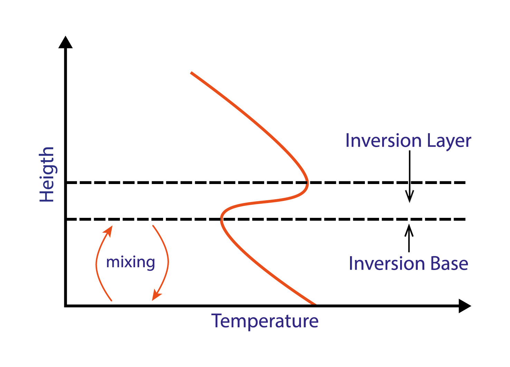
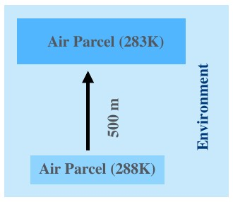
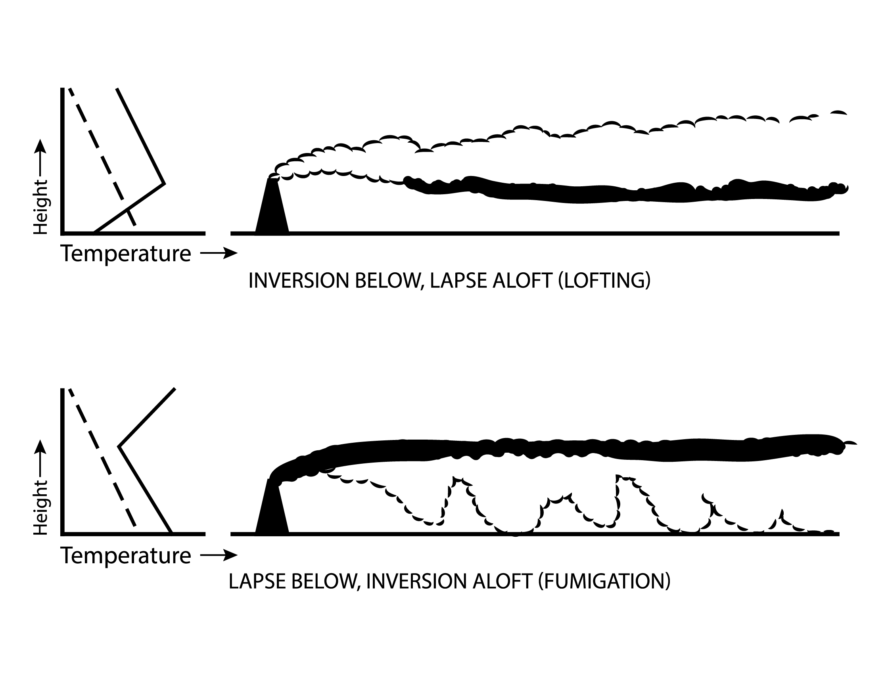

Building a Climate VII
======================

**Atmospehric Stability**

This lecture introduces the concepts and implications of atmospheric stability and instability.

Information
----------- 

+----------------------------------------------------------------------+
| Learning goals                                                       |
+======================================================================+
| * Understand atmospheric stability and how it relates to lapse rates |
| * Understand implications of thermal inversions and instability      |
+----------------------------------------------------------------------+

Temperature Lapse Rate 
----------------------

We have previously looked at the temperature lapse rates in the atmosphere and already came across a (stable) temperature inversion related to Ozone production: The stratospheric thermal inversion. We also see frequent, albeit very temporary, temperature inversions in the troposphere. Inversion is characterised by a reversed temperature gradient in the atmosphere, i.e. an increase in temperature with increased altitude. What are the implications of this for atmospheric movement?

    
   A temperature inversion will inhibit vertical movement. The inversion base, i.e. the lower boundary of an inversion layer, marks the altitude limit for the typical vertical mixing occuring below. [image: cc-by Lisa Rauschenbach]

Think back to the lecture on buyancy: Assuming we have no change in chemistry and pressure equalises quickly, an increase in temperature aloft will prevent an air parcel to become positively buoyant and thus inhibit vertical movement, so that the **inversion base**, i.e. the lower boundary of an **inversion layer**, marks the altitude limit for the typical vertical mixing occuring under normal temperature lapse rate conditions below.

Adiabatic Lapse Rate
--------------------

As a warm (and positively buoyant) air parcel rises, it moves into altitudes characterised by lower pressure. As a result, the air parcel expands. In more physical terms, it does work on the environment. This decreases the energy stored in the parcel and the air parcel begins to cool. This is a reversible process: As the cold air parcel sinks, it is compressed, the energy stored in it is increased and its temperature increases. 

This can happen, because temperature does not equalise quickly (though diffusion or mixing). In other words, there is no (or little) transfer of heat or mass between the system (the air parcel) and its surroundings (the environment/atmosphere). Energy transfer to and from surrounds only happens in form of **work** in a physical sense. In thermodynamics, a process with these characteristics is described as **adiabatic**. The temperature lapse rate of an air parcel as it rises and sinks in the atmosphere is therefore referred to as its **adiabatic lapse rate**.

Dry Adiabatic Lapse Rate
........................
   
The **dry adiabatic lapse rate** is the rate at which an unsaturated ("dry") air parcel warms or cools when moving vertically through the atmosphere. It is easier to calculate than the **moist/wet adiabatic lapse rate**, which is the rate at which a saturated ("wet") air parcel warms or cools when moving vertically through the atmosphere. 

The dry adiabatic lapse rate can be derived from the first law of thermodynamics:
   
.. math:: 

    \begin{equation}
      \Delta U = Q - W
    \end{equation}      

where: 
* \ :math:`\Delta U` \ - change in energy of a closed system
* \ :math:`Q` \ - heat/energy supplied to the system
* \ :math:`W` \ - work done by the system

and from the hydrostatic equation:

.. math:: 

    \begin{equation}
      \Delta P = -\rho · \Delta z · g    
    \end{equation}          
    
where:

* \ :math:`\Delta P` \ - change in pressure (pressure at the top - pressure at the ground)
* \ :math:`\rho` \ - density
* \ :math:`\Delta z` \ - change in height    
* \ :math:`g` \ - gravitational acceleration    
    
The dry adiabatic lapse rate is calculated as follows:    
    
.. math:: 

    \begin{equation}
      \Gamma = \frac {g}{C_p}   
    \end{equation}          
    
where:

* \ :math:`\Gamma` \ - dry adiabatic lapse rate
* \ :math:`g` \ - density
* \ :math:`C_p` \ - specific heat capacity  
    
.. note:: Can you derive the equation for the dry adiabatic lapse rate from the first law of thermodynamics and the hydrostatic equation?
    
    
Adiabatic Lapse Rate (Dry): Example
...................................
   

An unsaturated (dry) air parcel starts at a temperature of 288K and rises 500m. What would be its final temperature 500m above its starting height? We have previously established that the specific heat capacity of air is ~ \ :math:`1006 Jkg^{-1}K^{-1}` \. We can thus calculate the dry adiabatic lapse rate:  
   
.. math:: 

    \begin{equation}
      \Gamma = \frac {g}{C_p} 
      = \frac { 9.81 ms^{-2} }{ 1006 Jkg^{-1}K^{-1} }
      = 9.75 Km^{-1}
    \end{equation}          

and subtract ~4.9K (for 0.5km) from 288K. This gives us ~283K.    
    
    
.. note:: Theoretically, how much would an isolated parcel of helium cool over 500m vertical distance?
    
   
Atmospheric Stability
---------------------

Stable Atmosphere
.................

Stable atmospheric condidtions are created when both the environmental temperature gradient and adiabatic lapse rate are negative, but the adiabatic lapse rate is steeper, i.e. the temperature of the parcel changes more rapidly than the environmental temperature. Imagine the following scenario (and figure): An air parcel is slightly warmer than its surroundings (T(p) = air parcel temperature; T(e) = environmental temperature). It becomes buoyant and begins to rise (in the z direction). As it rises, it cools along its adiabatic lapse rate, which is different from the environmental temperature lapse rate (figure: top). More specifically (for stable atmospheric conditions), it cools at a higher rate than its surroundings. Eventually it reaches a temperature that is cooler than its surroundings (figure: middle). It sinks and warms along the adiabatic lapse rate until it is warmer than its surroundings (figure: bottom) and can rise again. These conditions limit vertical movement, prevent runaway effects and are thus considered stable. However, note that stable atmospheric conditions still allow for some vertical mixing and do not limit vertical movement as severely as temperature inversions.

Very Stable Atmosphere (Temperature Inversion)
..............................................

In case of temperature inversion, the environmental temperature gradient is reversed while the adiabatic lapse rate remains unchanged. When an air parcel is heated and begins to rise, it does not simply cool at a faster rate than the environment, as is the case for stable atmospheric conditions. It cools while the environment becomes warmer with greater altitude. The point at which the parcel becomes cooler than the environment (and sinks) is reached more quickly. The same applies for a parcel that is cooler than the environment and sinks. Therefore, temperature inversions vertically lock air parcels in place and create very stable atmospheric conditions.

Unstable Atmosphere
...................

Unstable atmospheric conditions are created when environment and parcel cool with altitude, but the environmental temperature gradient is steeper than the adiabatic lapse rate. As a warm air parcel rises, it cools more slowly than the environment, thus increasing the positive temperature difference between parcel and environment and causing the parcel to rise even further. We often observe these conditions in the tropics, where an unstable atmosphere causes this positive feedback loop and results in giant piled-up cumulunimbus clouds and thunderstorms. 

.. note:: What limits the rise of an air parcel in unstable atmospheric conditions? Think back to the temperature structure of the atmosphere. 
   

Stability and Vertical Mixing
.............................
   

   
   Smoke stack in different atmospheric stability conditions. [image: cc-by Lisa Rauschenbach]
   
Now that we covered the theory, let us examine a more tangible example if the implications of atmospheric stability. Imagine a smoke stack and its plume in a strong wind field. The 3 different scenarios in the figure differ only in the environmental temperature gradient or lapse rate. A very steep environmental lapse rate (steeper than the adiabatic lapse rate indicated by the dashed line) results in most vertical mixing and **looping** (figure: top). A weaker lapse rate (shallow environmental temperature gradient) still allows for some vertical mixing, but limits it much more (figure: middle). It results in **coning**. A temperature inversion severaly inhibits vertical mixing (figure: bottom) and results in **fanning**.

   
   Smoke stack in different, multi-layered atmospheric stability conditions. [image: cc-by Lisa Rauschenbach]

Let us consider 2 additional examples now. With an inversion near the surface and lapse aloft, vertical movement is severaly inbibited below while it is allowed aloft, resulting in a very assymetrical plume and **lofting** (figure: top). With inversion aloft and lapse below, vertical movement is severely inhibited aloft and permitted below (figure: bottom). This results in **fumigation**. For residents in the vicinity, this is a potentially dangerous situation. The height of smoke stacks is chosen to prevent such dangers. But how common (and long lived) are temperature inversions in the lower troposphere? This takes us to the last part of the lecture.
   
Troposphere Temperature Inversions
..................................   
   
Finally, let us look at one (common) example of how temperature inversions are created in the toposphere and may be related to day-night cycles. A cloudless night will allow the ground to lose more heat to the surroundings and results in especially cool grounds in the mornings. As the ground and atmosphere are exposed to more solar radiation again in the morning, the air aloft warms at a quicker rate than the very cold ground and the air just above the cold ground stays colder for longer. The result is a temporary temperature inversion in the mornings following cloudless nights. As the day progresses, the ground and air immediately above it warms up and the inversion dissipates.
   
   
