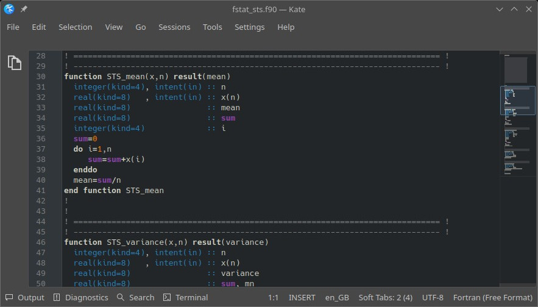
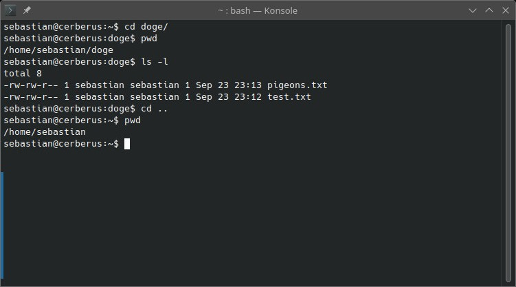

E001 - Getting Started
======================

In this exercise, you learn about some basic concepts of programming, commonly used tools, and how to write and execute a script. You may come across some important vocabulary that you are not yet familiar with. **We will explore this with modern Fortran (programming language).**

Information
-----------

+----------------------+--------------------------------------------------------+
| Topic                                                                         |
+======================+========================================================+
|**Concepts**          |                                                        |
|                      |   * programme                                          |
|                      |   * compilers                                          |
|                      |   * IDE, code highlighting, terminal emulator          |
|                      |   * data types                                         |
|                      |   * modules (Fortran)                                  |
+----------------------+--------------------------------------------------------+
|**Skills**            |                                                        |
|                      |   * code with only a text editor and terminal emulator |
|                      |   * create, compile and execute a programme            |
|                      |   * declaring parameters and variables                 |
|                      |   * using built-in functions                           |
+----------------------+--------------------------------------------------------+

.. topic:: What to Submit

      Submit your script for the final task of this exercise. The script should be named *[your student number]_e001.[ext]*, where *[ext]* is the file extension. In case of Python, this would be *.py*, for modern Fortran it is *.f90*, etc.

Compiled or Interpreted
-----------------------

There are a few differences between compiled and interpreted languages. These are highlighted below in a simplified manner to explain why we set up the workflow as described in the next section.

**Compiled Language**: The whole programme is translated into *machine code* (i.e. your computers "language") by a so-called **compiler**. In the compilation process, a new file is created (separate from the text file you wrote your code into). This (executable) file can be run as a programme without the need of the original code (text file).

- **Analogy**: It can be thought of as the process of translating a poem completely into another language, then reading the translated poem to an audience. The original poem (script) and translator are no longer needed.
- **Examples**: Fortran, C++
- **Advantages**: Usually faster performance, easy to control optimisations during compilation.

**Interpreted Language**: The programme does not have to be translated into *machine code* before execution. Instead, when you run your programme, your code (in the text file) is translated line-by-line by a so-called **interpreter**.

- **Analogy**: It can be thought of as someone reading a Bavarian poem and translating it line-by-line into English to an audience. The original poem (script) and translator are still needed.
- **Examples**: Python, JavaScript
- **Advantages**: More convenient, no need for manual compilation.

Workflow Setup
--------------

Fortran is a compiled language. Hence, our process will be: **write code > compile code > run executable file**. This means we will need the following tools to set up our workflow:

- We will write our code in a text editor with code-highlighting feature. For demonstration purposes, we will use `Kate <https://apps.kde.org/en-gb/kate/>`_. However, there are many great editors (e.g., `Emacs <https://www.gnu.org/software/emacs/>`_).

   Text editors like *Kate* support code highlighting, which will make your code much easier to read!

- We will execute our compiled programme from command line in a terminal emulator (also referred to as console in this document). There are many great options. If you are using any Linux or Unix operating system (incl. MacOS), you will most likely have a terminal emulator already installed. If you're using Windows, installing `Cygwin <https://www.cygwin.com/>`_ is recommended. For this tutorial, demonstrations will be done with KDE's `Konsole <https://konsole.kde.org/>`_ and *bash* shell (command-line interpreter). For the exercises here, you do not need to know *bash* commands well. You only need to know 3 commands:

    1. *ls* lets you view the content of your working directory (the folder  you are currently in). *ls -l* will list the contents line-by-line.
    2. You can find out which directory you are in by typing *pwd* (short for "print working directory").
    3. *cd* will change the directory you are working in. It is the equivalent of opening a folder in your file browser. For example: If you are currently in a folder *home/* that contains a subfolder named *doge/*, you can navigate to the subfolder by typing *cd doge*. If you want to navigate one folder level up, you simply type *cd ..*.

   *Konsole* is one of many well-established terminal emulators. The image demonstrates some useful bash commands. The commands are written in lines starting with $ and executed by hitting enter. The results of the commands are displayed in the other lines below them.

- We will compile our code with the `gfortran <https://gcc.gnu.org/fortran/>`_ compiler (version 10). Additional installation instructions can be found `here <https://fortran-lang.org/learn/os_setup/install_gfortran/>`_. The simplest way to compile your Fortran code with gfortran is by typing the following into your terminal emulator:

.. code-block:: bash

    gfortran [path1]/[code].f90 -o [path2]/[program].exe
    ./[program].exe

With the command in the first line, you are telling the compiler to compile your script with file name *[code]* located in the folder *[path1]* and create an executable file with file name *[program]* in the folder *[path2]*. The second line will run your progam. If you are working on a Linux/Unix system, you do not need the *.exe* file extension, but it may help you identify your executables.

Writing and Compiling a Simple Programme
----------------------------------------

.. code-block:: fortran

    program expr2
    implicit none

    integer :: x  ! comment

    x = (2+3)*5
    print *, x
    end program

The console should have returned *"wow, many print"*. In this case, the input argument was *"wow, many print"*, i.e. the value to be displayed, and the function *print* displayed it.
