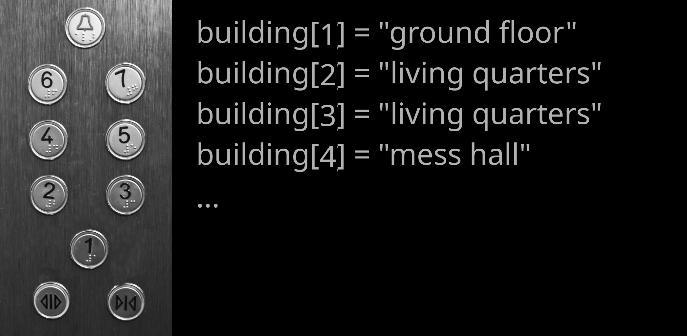

E002 (Fortran) - Arrays and Constructs
======================================

In this exercise, you learn about some more basic concepts of programming,
including arrays and ways to let your programme automate calculations and make
decisions. **We will explore these concepts using modern Fortran.**

Information
-----------

+----------------------+--------------------------------------------------------+
| Topic                |                                                        |
+======================+========================================================+
| **Concepts**         | * index value                                          |
|                      | * arrays and array operations                          |
|                      | * do loops                                             |
|                      | * if statements (if, else if, else)                    |
|                      | * comparison operators                                 |
+----------------------+--------------------------------------------------------+
| **Skills**           | * work with arrays                                     |
|                      | * implement a do loop                                  |
|                      | * let your programme make a decision                   |
+----------------------+--------------------------------------------------------+

Arrays
------

Collections of data can hold multiple values, and working with them saves a
lot of time, effort, and memory. In modern Fortran, an array is a collection
of values of the same declared type. For example, we can create an array containing years:

.. code-block:: fortran

    integer :: year(2)

    year = [2140, 2150]

The array ``year`` has two elements. A Fortran array has
a declared type, and all of its elements have that type.
Fortran arrays can also contain character values. For example:

.. code-block:: fortran

    character(len=20) :: station(2)

    station = ["EARTH", "MARS"]

When declaring an array, the dimensions can be given explicitly. A
one-dimensional array is akin to a mathematical vector.

Index Values
------------

If you print an array:

.. code-block:: fortran

    program indexing
        implicit none

        integer :: year(2)

        year = [2140, 2150]

        print *, year
    end program indexing

the programme displays both values.

Often, however, you will only want to use one of the values stored in an
array. This is where index values come in handy.

From mathematical notation, we are already familiar with index values. Think
about the notation for a simple sum of all elements in a vector **x**
(= 4, 1, 3, 9, 2):

.. math::

    \begin{equation}
      sum={\sum_{i=1}^{5} }x_i = x_1 + x_2 + x_3 + x_4 + x_5 = 4 + 1 + 3 + 9 + 2
    \end{equation}

Here, the index value ranges from 1 to 5. Index values in programming work in
the same way. The index value allows you to access a specific value in your
array.

Fortran arrays - just like mathematical vectors - normally start at index
**1**. This sets Fortran apart from many other languages that start with the index
**0** and makes it more intuitive in translating mathematical equations.

A good analogy for indexing are elevator controls that take you to floors with
different levels (contents) by pressing the appropriate floor number (index value).
In an elevator panel that follows Fortran-style indexing, 1 marks the ground floor.

Let's bring this concept back to coding. Consider the code below:

.. code-block:: fortran

    integer :: x(5)

    x = [4, 1, 3, 9, 2]

    print *, x(1)
    print *, x(5)

This displays the first and fifth elements of the array. You can perform
calculations on individual array elements by referencing their index:

.. code-block:: fortran

    print *, year(2) + 20

You can also update an array element:

.. code-block:: fortran

    year(2) = year(2) + 20
    print *, year(2)

Fortran arrays are mutable: their elements can be changed after the array has
been created.

Array Properties and Intrinsic Functions
----------------------------------------

Fortran provides intrinsic functions for working with arrays. Some useful
functions include:

* ``size(array)`` -- number of elements in an array;
* ``sum(array)`` -- sum of all elements;
* ``minval(array)`` -- smallest element;
* ``maxval(array)`` -- largest element;
* ``count(mask)`` -- number of ``.true.`` elements in a logical array.

For example:

.. code-block:: fortran

    program array_functions
        implicit none

        real :: values(5)

        values = [4.0, 1.0, 3.0, 9.0, 2.0]

        print *, "size =", size(values)
        print *, "sum =", sum(values)
        print *, "minimum =", minval(values)
        print *, "maximum =", maxval(values)
    end program array_functions

These intrinsic functions are especially useful because they allow common
array operations without having to write the corresponding loop yourself.

Comparison Operators
--------------------

Most decisions are based on examining a value, comparing it to a reference
value, and using their relation as a basis for decision.

+----------+--------------------------------+
| Operator | Meaning                        |
+==========+================================+
| ``==``   | equal to                       |
+----------+--------------------------------+
| ``/=``   | not equal to                   |
+----------+--------------------------------+
| ``<``    | less than                      |
+----------+--------------------------------+
| ``<=``   | less than or equal to          |
+----------+--------------------------------+
| ``>``    | greater than                   |
+----------+--------------------------------+
| ``>=``   | greater than or equal to       |
+----------+--------------------------------+

The general syntax for comparing two values is:

.. code-block:: fortran

    [value] [comparison operator] [reference value]

For example:

.. code-block:: fortran

    if (year > 2100) then
        print *, "future year"
    end if

If Statements
-------------

We let our programmes make decisions using ``if`` statements. For example:

.. code-block:: fortran

    program decision
        implicit none

        character(len=20) :: exercise

        exercise = "boring"

        if (exercise == "boring") then
            print *, "deal with it"
        end if

        print *, "done"
    end program decision

The ``if`` statement checks whether the value is equal to ``"boring"``.
Since the comparison is true, the first ``print`` statement is executed.

Notice the syntax used by Fortran:

* the condition is enclosed in parentheses;
* the statement is followed by ``then``;
* the conditional block is terminated by ``end if``;
* indentation is used to make the structure easier to read.

Try the same programme again, but assign ``"exciting"`` to ``exercise``. The
programme should then only display ``done``.

Alternative Conditions
~~~~~~~~~~~~~~~~~~~~~~

Decisions can be more complex than that. If one condition is not met, we may
want to check whether an alternative condition is true. We achieve this using
``else if``. The ``else`` statement covers all remaining cases. For example:

.. code-block:: fortran

    program decision
        implicit none

        character(len=20) :: target
        character(len=20) :: i_am
        character(len=20) :: action

        target = "human"
        i_am = "dalek"

        if (target == "dalek") then
            action = "run away"
        else if (target == "human") then
            if (i_am == "dalek") then
                action = "exterminate"
            else
                action = "greet human"
            end if
        else
            action = "do nothing"
        end if

        print *, action
    end program decision

Here, we have nested ``if`` statements. Play around with the values assigned
to ``target`` and ``i_am`` and execute the programme to get a better feeling
for how these statements work.

Combining Conditions
~~~~~~~~~~~~~~~~~~~~

It is also possible to combine comparisons using logical operators.
For example, ``.and.`` requires both conditions to be true:

.. code-block:: fortran

    if (target == "human" .and. i_am == "dalek") then
        action = "exterminate"
    end if

Fortran uses ``.or.`` when at least one of several conditions must be true:

.. code-block:: fortran

    if (i_am == "dalek" .or. i_am == "cyberman") then
        action = "a bad thing"
    end if

Other useful logical operators include:

* ``.and.`` -- both conditions must be true;
* ``.or.`` -- at least one condition must be true;
* ``.not.`` -- reverses a logical condition.

Do Loops
--------

``do`` loops, commonly called *for loops* in other languages, are essential
in programming because they allow you to automate repeated calculations.

Let's make the following array:

.. code-block:: fortran

    integer :: year(10)

    year = [1981, 1982, 1983, 1984, 1985, &
            1986, 1987, 1988, 1989, 1990]

Assume we made a systematic mistake in our array and would like to correct it
by adding 1 year to each entry. An inefficient way to do this would be:

.. code-block:: fortran

    year(1) = year(1) + 1
    year(2) = year(2) + 1
    year(3) = year(3) + 1
    year(4) = year(4) + 1
    year(5) = year(5) + 1
    year(6) = year(6) + 1
    year(7) = year(7) + 1
    year(8) = year(8) + 1
    year(9) = year(9) + 1
    year(10) = year(10) + 1

This is where ``do`` loops come in handy. We can tell our programme to perform
the same calculation for every entry in the array:

.. code-block:: fortran

    program update_year
        implicit none

        integer :: year(10)
        integer :: i

        year = [1981, 1982, 1983, 1984, 1985, &
                1986, 1987, 1988, 1989, 1990]

        do i = 1, 10
            year(i) = year(i) + 1
            print *, year(i)
        end do
    end program update_year

The programme executes the body of the loop for each value of ``i`` from 1
through 10.
The array's bounds can also be used so that the loop remains flexible if the
size of the array changes:

.. code-block:: fortran

    do i = 1, size(year)
        year(i) = year(i) + 1
        print *, year(i)
    end do

This is preferable to hard-coding ``10`` because the loop automatically
adapts to the size of ``year``.

Looping Over Part of an Array
~~~~~~~~~~~~~~~~~~~~~~~~~~~~~

If we only want to update everything after 1984, we can specify the starting
and ending index explicitly:

.. code-block:: fortran

    do i = 5, size(year)
        year(i) = year(i) + 1
        print *, year(i)
    end do

This loop starts with index 5, corresponding to the value 1985, and continues
through the final entry. The loop variable can also have a step size:

.. code-block:: fortran

    do i = 1, 10, 2
        print *, year(i)
    end do

This visits indices 1, 3, 5, 7, and 9.

Array Sections
--------------

Fortran also allows you to perform operations only on specific *array sections*,
which can make some operations more concise. For example, instead of looping over
every element to add one to an array, we can write:

.. code-block:: fortran

    year = year + 1

We can also operate on part of an array:

.. code-block:: fortran

    year(5:) = year(5:) + 1

The expression ``year(5:)`` means all elements from index 5 to the end of the
array.

Fortran has built-in support for a lot of array operations. This is one of the
language's many powerful features. There are, for example, additional ways of
array slicing:

.. code-block:: fortran

    program array_slicing
      implicit none

      integer :: i
      integer :: array1(10)      ! a 1D array of integers with 10 elements
      integer :: array2(10, 10)  ! a 2D array of integers with 10 x 10 (100) elements

      array1 = [1, 2, 3, 4, 5, 6, 7, 8, 9, 10]  ! array constructor; stores numbers 1 - 10 in array1
      print *, array1

      array1 = [(i, i = 1, 10)]  ! implied do loop constructor to achieve the same as above
      print *, array1

      print *, array1(1:5:2)     ! print out elements from 1 to 5 in strides of 2
      print *, array1(10:1:-1)   ! print the whole array in reverse

      array1(:) = 303            ! set all elements to 303 (without a loop)
      print *, array1

      array1(1:5) = 404          ! set first 5 elements to 404
      print *, array1

      print *, array2(:,1)       ! print only the first column in our 2D array

    end program array_slicing

Fortran's array syntax can therefore often replace many simple loops. Loops remain
important, however, when each iteration requires more complicated operations
or decisions.

You can learn about more array functionality on `this Fortran-lang tutorial page <https://fortran-lang.org/learn/quickstart/arrays_strings/>`_.

Your Task
---------

You just finished grading 9 exams on atmospheric physics (ugh!). You have 10
students (and number them in a rather dystopian manner), but only 9 of them
showed up. You saved the grades in an array and entered a ridiculous number
(``-9999.0``) for the missing student, so you know they didn't take the exam.

Create the following array:

.. code-block:: fortran

    real :: g(10)

    g = [1.7, 2.0, -9999.0, 2.3, 1.3, &
         1.0, 1.3, 3.3, 1.7, 1.0]

You now want to calculate the arithmetic mean of the students' grades
according to:

.. math::

    \begin{equation}
      mean = \frac { {\sum_{i=1}^{n} }g_i } n
    \end{equation}

Since one of the students was missing, :math:`n=9`.

Write code for at least **two different ways** to calculate the mean grade
based on the ``g`` array. Somewhere in your code, you should make use of the
following:

* array operations or intrinsic array functions;
* comparison operators;
* ``if`` statements;
* ``do`` loops.

Try to keep your code as flexible as possible. Ideally, it should still work
next year, when a different student may be missing (corresponding to a
different position in your array) or when more students fail to take the
exam.

Also make sure you comment each executable instruction in the programme to
let other programmers know what you are doing.

When you are happy with your code, put your two (or more) different methods
in one file. Save your programme as `e001_[your student number].f90` and submit it.

.. warning::

    Late submissions won't be accepted!
